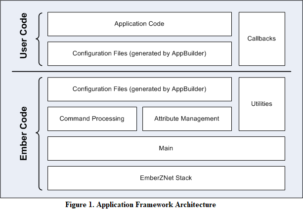

# Ember® 应用框架开发指南 <!-- omit in toc -->

Ember 应用框架是一个嵌入式 C 代码体，可以通过 Ember AppBuilder 来配置它，以实现任何 ZCL（ZigBee Cluster Library）应用。本指南涵盖了 Ember 应用框架的结构和用法。在适当的情况下，我们添加了一些信息来概括最新版本的 Ember 应用框架与先前版本之间的差异。

## 新增内容 <!-- omit in toc -->

增加第 18 章。

## 目录 <!-- omit in toc -->

- [1. 引言](#1-引言)
  - [1.1 目的](#11-目的)
  - [1.2 构建应用](#12-构建应用)
  - [1.3 移植应用](#13-移植应用)
- [2. AF 架构](#2-af-架构)

# 1. 引言

## 1.1 目的

Ember AF（application framework，应用框架）是一个嵌入式 C 代码体，可以通过 Ember AppBuilder 来配置它，以实现任何 ZCL 应用。该 AF 位于 `app/framework` 目录中。

本指南涵盖了 Ember AF 的结构和用法。在适当的情况下，我们添加了一些信息来概括最新版本的 Ember AF 与先前版本之间的差异。

## 1.2 构建应用

使用 Ember AF，只需通过几个步骤就能创建一个应用。

1. 使用 Ember AppBuilder 创建 Ember AF 配置文件。该配置文件及所选平台的项目文件由 Ember AppBuilder 生成。本手册的第 17 章概括了 Ember AppBuilder 的使用及其与 Ember AF 的关联。有关如何使用 Ember AppBuilder 的更多详细信息，请参阅 Ember AppBuilder 的 Help 菜单（`Help | Help Contents for indexed help and Help | Dynamic Help for context-sensitive help`）。
2. 将应用的细节写入到随配置文件一起生成的回调函数中。使用 Ember AF API 可以做一些事（如在 ZigBee 网络上，与 attribute 交互；发送、接收和响应 command）。有关 Ember AF API 的更多详细信息，请参阅 [5. AF API]()。
3. 将生成的项目文件打开到所选芯片的 IDE 中，编译应用，然后将其加载到开发套件上。
4. 运行应用并使用 Ember Desktop 控制台窗口和应用 CLI（command line interface，命令行接口）与其进行交互。有关如何使用 Ember Desktop 的更多信息，请参阅 Ember Desktop 的在线帮助（`Help | Help Contents`）。

## 1.3 移植应用

有关移植过程的信息，请参阅 stack release 中包含的 **Ember Application Framework Release Notes (document number 120-8098-000A)**。

# 2. AF 架构

Ember AF 在 Ember stack 上使用 stack "handler" 接口，并向开发者公开其自身更抽象的和应用特定的接口。

Ember AF 的主要特性之一是将用户创建的代码和 Silicon Labs 创建的代码分离。虽然 Silicon Labs 提供了 Ember AF 的所有源代码，但是用户应该在该框架外创建代码，并且应该通过框架公开的实用程序（utility）和回调（callback）与框架进行交互。Figure 1 展示了 Ember AF 架构的概览及两个代码库的分离。

`app/framework/util` 中包含的 `main` 文件使用 Ember Stack handler 接口，并将 Ember AF 结合到 EmberZNet PRO stack 中。两个 `main` 文件位于 `app/framework/util` 目录中，`af-main-soc.c` 用于 SoC（如 EM35xx 平台）和 `af-main-host.c` 用于与 NCP（Network Co-Processor，网络协处理器）搭配的 host 微处理器。

`main` 文件执行 `emberIncomingMessageHandler()`，并将所有传入消息传递给 Ember AF 以进行 command 处理。一旦传入消息被处理，它们将被传递到对应的 cluster 以进行处理，或者直接传递给 cluster-specific 回调（由 Ember AppBuilder 生成）。`Command` 处理代码的重要（significant）部分直接由 `tool/appbuilder` 中包含的 ZCL XML 文档生成。

从 ZCL XML 文档生成的所有代码和头文件与应用头文件和回调文件一起被生成到 `app/builder/<application name>/` 中。
