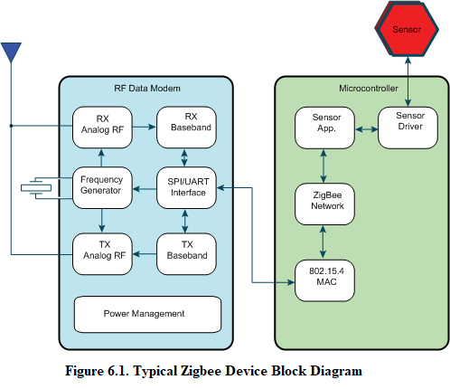

# 无线网络应用开发基础 <!-- omit in toc -->

## 目录 <!-- omit in toc -->

- [1. 概述](#1-概述)
- [2. 嵌入式网络](#2-嵌入式网络)
- [3. 无线电基础](#3-无线电基础)
  - [3.1 频段](#31-频段)
  - [3.2 信号调制](#32-信号调制)
  - [3.3 天线](#33-天线)
  - [3.4 信号传播距离](#34-信号传播距离)
    - [3.4.1 无线电发射功率](#341-无线电发射功率)
    - [3.4.2 信号衰减](#342-信号衰减)
    - [3.4.3 无线电信号传播距离](#343-无线电信号传播距离)
- [4. 网络：基本概念](#4-网络基本概念)
- [5. 无线网络](#5-无线网络)
- [6. 网络设备](#6-网络设备)

# 1. 概述

随着嵌入式系统的发展和物联网（IoT）的出现，对网络的支持已成为基本的设计要求。与许多通用计算机一样，嵌入式系统已经转向无线网络。大多数的无线网络趋向更高的数据速率和更大的点对点范围，但并非所有应用都需要高端的无线网络能力。低数据速率应用可能比高数据速率应用要多。简单的应用，如照明控制、智能电表、暖气设备、通风设备、空调控制、火灾/烟雾/一氧化碳警报、远程门铃、湿度监视器、能源使用监视器等设备都可以很好地使用低数据速率监控系统。安装此类设备无需大量布线，这降低了安装和维护成本。这种应用技术背后的主要目的是提高效率和节省成本。

无线传感网络（WSN）是一个由分布式设备组成的无线网络，这些分布式设备使用不同位置的传感器来协作监视物理或环境状况，如温度、声音、振动、压力、运动或污染物。

除了一或多个传感器外，传感网络中的每个节点一般配备有无线电收发器或其他无线通信设备、小型微控制器和能量源（通常是电池）。单个传感节点可以做成硬币大小。传感节点的成本取决于传感网络的大小和各个传感节点的应用复杂性。能量、存储、计算速度和带宽等资源受传感节点的尺寸和成本限制。

无线个域网的出现得益于 IEEE 802.15.4 标准，该标准用于嵌入式设备间的低数据速率数字无线电连接。在该标准的 MAC 和 PHY 层之上，已经建立起了许多标准（如 Zigbee Alliance 和 Thread Group），这些标准的建立是为了标准化行业并为基于 802.15.4 的网络解决方案提供技术，它们具有低数据速率和低功耗的特征。Zigbee 标准使组建经济高效的住宅（及类似建筑）监控网络成为可能。Thread 标准则为这些小型嵌入式设备带来了 IPv6。

# 2. 嵌入式网络

虽然术语无线网络专用于指代哪些在不需要互连线路的情况下起作用的任何类型的网络，但该术语通常指的是电信网络，如计算机网络。无线电信网络一般是通过为载波或网络的物理层提供无线电来实现的。

无线局域网是无线网络的其中一种类型，它在同一网络上的计算机间使用无线电（非电线）来回传输数据。无线局域网在酒店、咖啡店和其他公共场所已经十分常见。无线个域网（WPAN）将这项技术带入了一个新的领域，在这个领域中，网络设备之间所需的距离相对较小、数据吞吐量较低。

在控制领域，嵌入式系统已成为使用本地专用计算机硬件操作设备的常见系统。这种设备的有线网络现在在制造环境和其他应用领域中很常见。像所有的计算机网络一样，互连电缆系统和支持硬件是混乱的、昂贵的，并且有时安装困难。为了克服这些问题，嵌入式系统的无线网络（即嵌入式网络）已经变得常见。然而，昂贵的嵌入式网络解决方案仅在成本是次要考虑因素的高端应用中才是合理的。在 2003 年发布的用于无线个域网的 PHY 和 MAC 层的 IEEE 802.15.4 标准之前，具有低数据速率通信要求的低成本应用没有一个很好的标准化解决方案。

> 注意：撰写本文时的当前版本是 [IEEE 802.15.4-2006 标准](http://standards.ieee.org/getieee802/download/802.15.4-2006.pdf)。

Zigbee Alliance 的成立是为了在 IEEE 802.15.4 标准之上建立网络和应用级标准，以实现灵活性、可靠性和互操作性。Zigbee 802.15.4-2003 规范 1.0 于 2005 年获得批准，Zigbee 2006 规范于 2006 年宣布（废除了 2004 年的协议栈）。在互联网工程任务组（IETF）内部成立了工作组（WG），以建立开放式标准路由方法（roll WG）以及将低功率无线设备连接到 IPV6 网络（6lowPan WG）。最近，Thread Group 成立于 2014 年，旨在利用开放式 IP 标准、mesh 网络和 802.15.4 来支持各种家庭网络产品。

虽然无线网络无需杂乱的电缆并增强了安装的移动性，但其缺点是可能会存在阻止无线电信号在设备间传递的干扰。这种干扰可能来自其他无线网络或来自干扰无线电通信的物理障碍物。通常可以通过使用不同的信道来避免来自其他无线网络的干扰。例如，Zigbee 在网络启动时使用信道扫描机制，以避开拥挤的信道。基于标准的系统，例如 Thread、Zigbee 和 Wi-Fi，在 MAC 层使用该机制来允许信道共享。此外，Zigbee 和 Thread 为多跳无线网络提供了可互操作的标准，允许信号通过多个中继点到达目的地。这些网络可以包括许多这样的中继点或 “路由器”，每个都在一个或多个其他路由器的范围内，创建一个互连的 “mesh” 设备，可以为网络中的数据提供自动重新发现和使用冗余路径避免局部干扰。这个概念统称为 “mesh 网络”。

另一个潜在的问题是无线网络可能比通过电缆直接连接的网络慢。然而，并非所有应用都需要高数据速率或大数据带宽。大多数嵌入式网络在降低吞吐量时运行良好。应用设计者需要确保其系统数据速率在系统使用时可达到的范围内。

无线网络的安全性也是一个问题，因为窃听设备很容易窃听数据。Zigbee 和 Thread 拥有一套围绕高级加密标准（AES）128 加密设计的安全服务，因此应用设计者可以根据应用的需求选择安全级别。围绕这些标准的精心设计有助于保持高水平的网络安全性。

同时还有其他网络标准，如经典蓝牙。每个标准都有自己独特的优势和应用领域。蓝牙的带宽为 1Mbps，而基于 802.15.4 的协议则为此值的四分之一。经典蓝牙的优势在于它能够实现互连和替代电缆。Zigbee 和 Thread 的优势在于成本低、电池寿命长，以及用于大型网络的 mesh 网络。蓝牙适用于手机和耳机等点对点应用，而 Zigbee 和 Thread 则专注于传感器和遥控器市场、大型分布式网络以及高度可靠的 mesh 网络。低功耗蓝牙作为另一种低功耗无线技术正在迅速崛起，它非常适合点对点应用（例如使用智能手机控制单个设备）。

虽然过去每个芯片都只支持单一协议，但新开发的芯片可允许两个协议在同一芯片上运行。这种多协议操作可以像支持不同协议的芯片技术一样简单，其在制造期间加载选择的应用协议。最近，诸如 Silicon Labs EFR32 产品和共享操作基础设施等芯片允许两种协议共享同一个无线电。例如，动态多协议实现可能允许最终用户使用智能手机上的低功耗蓝牙应用来控制设备（动态多协议设备）或执行诊断，同时设备仍然连接到其 Zigbee 家庭自动化网络中。**UG103.16: Multiprotocol Fundamentals** 中描述了四种不同的多协议模式和它们的操作要求，并讨论了在实现多协议设备时要考虑的一些事项。

# 3. 无线电基础

无线电是通过调制频率低于可见光的电磁波来无线传输信号。就无线电而言，电磁波是一种非电离辐射，其通过穿过电导体、空气和真空的振荡电磁场传播。电磁辐射不需要像声波那样的传输介质。通过系统地改变（调制）辐射波的某些特性（如幅度或频率），可以对电磁波施加信息。当无线电波通过电导体时，振荡场在导体中感应出交流电流。这样就可以被检测到并转换成声音或其他信号，以再现所施加的信息。

“无线电” 一词用于描述这种现象，无线电传输信号被归类为射频发射（radio frequency emissions）。用于通信的无线电波的范围或频谱已被分成任意单元以进行识别。美国联邦通信委员会（FCC）和国家电信与信息协会（NTIA）将美国的无线电频谱定义为频率介于 9 千赫兹到 300 千兆赫兹之间的电磁辐射的自然频谱部分，并为方便起见，将其划分为不同的子频谱。

以下名称通常用于标识各种子频谱：

| 名称 | 子频谱 |
| :--  | :-- |
| 甚低频(VLF) | 3kHz ~ 30kHz |
| 低频(LF) | 30kHz ~ 300kHz |
| 中频(MF) | 300kHz ~ 3,000kHz |
| 高频(HF) | 3,000kHz ~ 30,000kHz |
| 甚高频(VHF) | 30,000kHz ~ 300,000kHz |
| 特高频(UHF) | 300,000kHz ~ 3,000,000kHz |
| 超高频(SHF) | 3,000,000kHz ~ 30,000,000kHz |
| 极高频(EHF) | 30,000,000kHz ~ 300,000,000kHz |

上面列出的每个子频谱进一步细分为许多其他子部分或 “频段”。例如，美国的 AM 广播频段从 535kHz 到 1705kHz，这处于中频频谱范围内。

## 3.1 频段

无线电频谱由政府机构和国际条约管理。大多数发射台（包括商业广播公司、军事、科学、工业和业余无线电台）都需要许可证才能运营。每个许可证通常定义了操作类型、功率级别、调制类型的限制，以及分配的频段是独占还是共享使用。有三个频段可用于发射无线电信号，而无需美国政府许可：

* 900MHz - 900MHz 频段在不同的国家中广泛用于寻呼机和蜂窝设备等产品。该频段被认为具有良好的范围特性。但是，它可能不太受欢迎，因为它不是全球的无需许可证频段，因此产品需要根据它们的使用位置进行修改。
* 2400MHz - 2400MHz 频段是一个常用的频段。该频段是全球首批的无需许可证频段之一，因此被使用在主流的无线消费产品上。使用此频段的无线技术一般是 802.11b（1 ~ 11Mbps）、802.11g（1 ~ 50Mbps）和 802.15.4，以及众多专有无线电类型。
* 5200 ~ 5800MHz - 5200MHz 频段有三个子频段，最低的仅用于室内家用。而 5800MHz 频段可用于非常快速（30 ~ 100Mbps）的长距离无线连接。

常用的策略是在住宅和家庭环境中使用 2400MHz。Zigbee Alliance 和 Thread Group 都支持使用这个频段，并且两者都在寻找其他的 SubGHz 频段以扩展自身能力。

## 3.2 信号调制

调制是改变信号行为以传输信息的过程。调制也可以被认为是一种编码信息的方式，信息将传递给一个能将信息解码或解调成有用的形式的接收器上。

基本射频（RF）信号有一个可以被视为交流电的基频，其频率被称为载波频率。最早用于将信息编码到载波上的方法涉及在一个特定持续时间式下的开关载波，这被称为连续波（CW）模式。载波频率也可以在其幅度（即信号强度）或其频率上变化，这两种调制方法分别称为幅度调制（AM）和频率调制（FM）。使用这三种基本的调制技术及其新变种，可以将信号施加到载波上。

Silicon Labs 的 EFR32 和 EM3x 集成电路系列使用一种偏移正交相移键控（OQPSK）来调制载波。相移键控（PSK）是一种数字调制方案，其通过改变或调制参考信号（如载波）的相位来传输数据。PSK 是 FM 技术的衍生物。

所有数字调制方案都使用有限数量的不同信号来表示数字数据。在 PSK 下，使用有限数量的相位。每个相位都分配有一个唯一的二进制位式。通常，每个相位编码的比特数相等。每个比特式形成了由特定相位表示的符号。调制器是专门为所使用的符号集设计的，它确定接收信号的相位并将其映射回它所代表的符号，从而恢复原始数据。为此，接收器必须将所收到信号的相位与参考信号进行比较。这种系统被称为相干（coherent）。

## 3.3 天线

天线（或触角）是一种设计用于发射或捕获电磁波的电导体装置。天线发射出可由另一天线检测的信号的能力被称为无线电传播。天线根据工作频率制成一定的尺寸。2400MHz 无线电的天线无法用在 5800MHz 无线电上，反之亦然。但是，一种 2400MHz 技术的天线（如 Wi-Fi 或蓝牙），可用于另一种 2400MHz 技术（如 Zigbee 或 Thread）。

根据特定的三维空间描述了两种基本的天线类型：

* 全向（Omni-directional）：在所有方向上均匀辐射。
* 单向（Uni-directional）：在一个方向上比在另一个方向上辐射更多。所有天线在自由空间的所有方向上辐射一定的能量，但细致的构造导致能量在特定方向上进行实质性的传输而在其他方向上辐射的能量可以忽略。

一般而言，由于 mesh 网络的性质，使用全向天线预期可以提供尽可能多的通信路径。

## 3.4 信号传播距离

无线电信号的传播距离和可传输的信息量基于：

* 天线向空中发射的功率。
* 发射站和接收站之间的距离。
* 接收无线电需要的无线电信号强度。
* 路径上的物理/电气障碍物类型。

### 3.4.1 无线电发射功率

无线电发射功率以瓦特为单位，并且通常以 dBm（1mW 对应的 dB 量）来表示。将瓦特数转换为 dBm 允许使用简单的加减运算进行无线电链路计算（`dBm = 10 * log10(P / 0.001)`）。

例如，一般的功率放大无线射频卡的发射功率为 100mW，即输出功率为 20dBm。

如果 1mW 或 0dBm 是 dB 的功率基准，则 +3dBm 是 1mW 以上的某个功率水平（具体为 2mW）。这是 EM3x 设备的标准输出功率。在 Boost 模式下，EM3x 平台上可以增加到 +8dBm 或 6.3mW。使用功率放大器模块可以将发射功率增加到 20dBm，但这需要更多的功耗。EFR32 平台包含了一些 +13dBm 的变体和其他高达 +20dBm 的变体（两者都没有外部功率放大器的帮助）。

### 3.4.2 信号衰减

无线电需要能够听到一定程度的无线电信号。接收器能够正确接收数据时所需的最小信号强度称为接收灵敏度（receive sensitivity）。

无线电信号在空中传播时会衰弱。当无线电信号离开发射天线时，其 dBm 是一个高的数字（如 20dBm）。当它在空中传播时，它会失去能量并下降到一个负数。在某些时候，dBm 将达到最小值；若低于该值，无线电将不能成功接收。该值表示为 “接收灵敏度” 或 “Rx 灵敏度”。该值将随所用无线电的类型而变化，但通常在 -90dBm 到 -100dBm 之间（有关特定的接收灵敏度数据，请参阅无线电芯片的数据手册）。

如果您的信号可以达到 -75dBm 并且无线电的接收灵敏度为 -95dBm，则您有额外的 20dBm 来适应干扰和其他问题，这称为余量（margin）。

### 3.4.3 无线电信号传播距离

如果您知道输出功率和接收器灵敏度，那么就可以确定是否可以在给定距离内进行广播。在以下示例中，您想知道是否可以接收超过 5 英里的信号。为此，您需要知道无线电发射器和接收器之间的自由空间损耗。

例如，2.4GHz 信号在 5 英里处的自由空间损耗为 118.36dB。您可以估算网络范围内的信号强度：

| 内容 | 加/减 | 值 |
| :-- | :--: | :--: |
| 发射器功率 | + | 15dBm |
| 发射器天线增益 | + | 14dBi |
| 接收器天线增益 | + | 14dBi |
| 发射器同轴电缆损耗 | - | 2dB |
| 接收器同轴电缆损耗 | - | 2dB |
| 5 英里的自由空间损耗 | - | 118.36dB |
| | 总计：| -79.36dBm |

换句话说，一个 15dBm 的无线电连接到 14dBi 天线，通过自由空间将信号传输到 5 英里处的另一个连接到 14dBi 天线的无线电，产生大约 -79dBm 的信号。注意，带增益的天线必然是定向的，并且需要彼此对准。但是，建筑物或树木等物理障碍物会对这些计算产生巨大的影响。一般的 Zigbee 和 Thread 网络使用体积较小、成本较低的天线（不带增益），并且只有在需要扩展范围时才使用功率放大器。有时，外部低噪声放大器（LNA）也可用于在传入信号到达无线电之前提高接收器灵敏度。

此处计算仅作为示例。EmberZNet 和 Silicon Labs Thread SDK（软件开发套件）附带功能测试应用（“NodeTest”），可用于在几乎任何环境中对嵌入式无线网络执行实验范围测试（有关使用 NodeTest 的信息，请参阅文档 **AN1019: Using the NodeTest Application**）。Silicon Labs 建议在预期的环境中进行基本范围测试，以评估是否需要扩展范围。

# 4. 网络：基本概念

网络是由计算机和其他设备（例如打印机和调制解调器）组成的系统，它们能够以一种可交换数据的方式连接在一起。这些数据可以是信息或命令，或两者的组合。

网络系统由硬件和软件组成。网络上的硬件包括物理设备（如计算机工作站）、外围设备，以及充当文件服务器、打印服务器和路由器的计算机。这些设备都称为网络上的节点。

如果节点不是全部都连接到单个物理电缆上的话，则需要特殊的硬件和软件设备来连接不同的电缆，以便将消息转发到其目标地址。桥接器或中继器是一种连接网络电缆的设备，其不检查消息地址或决定消息的最佳路径。相反，路由器包含寻址和路由信息，使其能够从消息的地址确定消息的最有效路由。在将消息传达到目的地之前，可以将消息在多个路由器间传递。

为了交换数据，节点必须使用一组通用的规则来定义数据的格式以及数据的传输方式。协议是用于数据交换的形式化的程序规则集。协议还为网络互连节点之间的交互提供了规则。网络软件开发者在执行协议所需功能的软件应用程序中实现这些规则。

路由器只有在使用相同的协议和地址格式时才能连接网络，而网关会转换地址和协议以连接不同的网络。这样的一组互连网络可以称为因特网（internet）、内联网（intranet）、广域网（WAN）或其他专用网络拓扑。术语互联网（Internet）通常用来指代全球最大的网络系统，也称为万维网。用于实现万维网的基本协议称为 Internet 协议或 IP。

网络协议通常使用另一个更基本的协议的服务来实现其目的。例如，传输控制协议（TCP）使用 IP 来封装数据并通过 IP 网络传输数据。使用底层协议的服务的协议被称为较低层协议的客户端（如 TCP 是 IP 的客户端）。以这种方式相关的一组协议称为协议栈。

# 5. 无线网络

无线网络模仿有线网络，但使用无线电信号来代替线缆作为数据互连介质。协议本质上与有线网络中使用的协议相同，尽管添加了一些额外的功能，因此这两种类型的网络仍可互操作。然而，已经出现了一些无线网络，其没有需要互操作的有线对应物；这些专用网络拥有自己的硬件和软件基础，可在其独特的环境范围内实现可靠的网络连接。

> 注意：大多数网络协议在某种程度上都基于开放式系统互连（OSI，Open Systems Interconnection）模型。

# 6. 网络设备

Silicon Labs 开发了网络硬件（EFR32xG 和 EM3x 系列）和 SDK（EmberZNet SDK、Silicon Labs Thread SDK、Flex SDK 以及其他协议栈和应用开发工具），以便实现用于传感和控制的无线个域网设备。下图是使用 Silicon Labs 网络技术之一的 Zigbee 典型无线设备。射频数据调制解调器是负责在网络上发送和接收数据的硬件。微控制器代表计算机控制元件，它发起消息并响应收到的任何信息。传感器块可以是任何类型的传感器或控制设备。这样的系统可以作为网络上的节点而无需任何额外的设备。具有兼容软件的任何两个这样的节点都可以形成网络。大型网络可以包含数千个这样的节点。

诸如 EM3x 或 EFR32xG 系列的芯片提供上图中的射频和微控制器部分。当用作 “网络协处理器” 时，芯片仅提供系统的射频和网络部分，充当任何微控制器、数字信号处理（DSP）或应用所需的类似设备的协处理器。

有关各种网络技术的详细信息，请参阅网络技术特定的基础知识文档。
