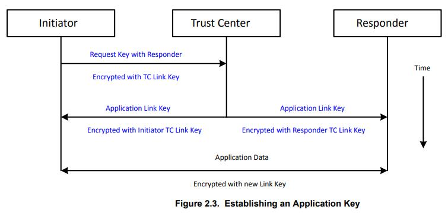

# **UG103.5：Application Development Fundamentals：Security** <!-- omit in toc -->

本文档介绍了一些基本的安全概念，包括网络层安全，信任中心和应用支持层安全特性。然后讨论了 EmberZNet PRO 中可用的标准安全协议的类型。总结了对实施安全的编码要求。最后，提供了有关实施 ZigBee Smart Energy 安全的信息。

Silicon Labs 的应用程序开发基础系列涵盖了项目经理，应用程序设计人员和开发人员在开始使用 Silicon Labs 芯片，EmberZNet PRO 或 Silicon Labs Bluetooth Smart 等网络栈以及相关开发工具的嵌入式网络解决方案之前应该了解的主题。这些文档可以作为任何需要介绍开发无线网络应用程序的人或者是 Silicon Labs 开发环境的新手的起点。

关键点：
* 介绍 ZigBee 栈架构
* 介绍基本安全概念，如网络层安全，信任中心网络和 APS 层安全
* 定义用于以不同方式保护数据的不同密钥
* 描述 ZigBee Smart Energy（ZSE）安全

------------------------------------------------------------------------------------------------------------------------

- [**1. 引言**](#1-引言)
- [**2. 概念**](#2-概念)
    - [**2.1 网络层安全**](#21-网络层安全)
        - [**2.1.1 网络密钥**](#211-网络密钥)
        - [**2.1.2 逐跳安全**](#212-逐跳安全)
        - [**2.1.3 包安全**](#213-包安全)
        - [**2.1.4 辅助报头**](#214-辅助报头)
        - [**2.1.5 认证和加密**](#215-认证和加密)
        - [**2.1.7 未加密的网络数据**](#217-未加密的网络数据)
    - [**2.2 信任中心网络**](#22-信任中心网络)
    - [**2.3 分布式信任中心网络**](#23-分布式信任中心网络)
    - [**2.4 APS 层安全**](#24-aps-层安全)
        - [**2.4.1 端到端安全**](#241-端到端安全)
        - [**2.4.2 链接密钥**](#242-链接密钥)
        - [**2.4.3 未加密的 APS 数据**](#243-未加密的-aps-数据)

------------------------------------------------------------------------------------------------------------------------

# **1. 引言**

安全性是 ZigBee 架构中主要关心的。虽然 ZigBee 使用 IEEE 802.15.4 中的基本安全元素（例如，高级加密标准（AES）加密和计数器与 CBC-MAC（CCM）安全模式），但它扩展了以下内容：
* 128 位 AES 加密算法
* 美国国家标准与技术研究院（NIST）批准的安全
* 定义的密钥类型（链路，网络）
* 定义的密钥设置和维护
* 密钥可以硬连线到应用程序中
* CCM\*（统一/更简单 的操作模式）
* 信任中心
* 可以为应用程序自定义的安全

如下图所示，安全服务提供者阻止与应用层和网络层的交互。

ZigBee 现在支持一种单一定义的安全模式，称为标准安全（Standard Security）。该模式中存在各种策略来控制设备在网络上的行为或交互方式。早期版本的 ZigBee 标准采用的是称为住宅安全（Residential Security）和高级安全（High Security）的模式。这些都已被弃用。

> Note：ZigBee 不使用 IEEE 802.15.4 MAC 级安全，因此 EmberZNet PRO 不支持这种安全，此处不再赘述。ZigBee 在网络和应用层实现消息安全。

本文档首先介绍了一些基本的安全概念，包括网络层安全，信任中心和应用支持层安全特性。然后讨论了 EmberZNet PRO 中可用的标准安全协议的类型。总结了对实施安全性的编码要求。最后，提供了有关实施 ZigBee Smart Energy 安全的信息。详情可以在文档 **AN714：Smart Energy ECC-Enabled Device Setup** 中找到。

那些已经熟悉 ZigBee 安全概念的人可以跳到 [4. ZigBee Smart Energy（ZSE）安全]()。

------------------------------------------------------------------------------------------------------------------------

# **2. 概念**

## **2.1 网络层安全**

本节介绍 ZigBee 如何在网络层实现安全，这适用于标准安全。网络安全提供了独立于可能在 ZigBee 节点上运行的应用程序的安全。所有经过 ZigBee 认证的设备都必须使用网络层安全。它提供了基本的访问控制，用于控制允许哪些节点参与特定的 ZigBee 网络。有关应用控制安全，请参阅 [2.4 APS 层安全]()。

### **2.1.1 网络密钥**

网络安全使用一个全网络的密钥进行加密和解密。所有被授权加入网络的设备都有密钥的副本，并使用它来加密和解密所有网络消息。网络密钥还具有一个与其关联的序列号，用于标识密钥的特定实例。当更新网络密钥时，序列号会递增，以允许设备识别使用哪个网络密钥实例来保护包数据。序列号的范围是 0 到 255。当序列号达到 255 时，它将回绕到 0。

> Note：所有 ZigBee 密钥的长度均为 128 位。

所有属于安全 ZigBee 网络的设备都具有网络密钥的副本。

### **2.1.2 逐跳安全**

需要注意的是，ZigBee 中的网络安全是在逐跳基础上进行的。在完成任何更多处理之前，每个中继已加密数据包的路由器首先验证它是否是一个有效的已加密数据包。路由器通过执行 ZigBee 解密机制和验证数据包完整性来验证数据包。然后，在将消息发送到下一跳之前，它会使用自己的网络参数（如源地址和帧计数器）重新加密数据包。如果没有此保护，攻击者可以将消息重播到网络中，该消息将通过多个设备进行路由，从而消耗网络资源。使用逐跳安全性允许路由器阻止将错误流量注入网络的尝试。

### **2.1.3 包安全**

网络层上担保的包由下图所示的元素组成。

### **2.1.4 辅助报头**

辅助报头包含关于包安全的数据，接收节点使用该数据来正确地认证和解密包。该数据包括所使用的密钥类型，序列号（如果为网络密钥），担保数据的设备的 IEEE 地址及帧计数器。

### **2.1.5 认证和加密**

ZigBee 使用 128 位对称密钥（AES-128）加密网络层上的所有传输。网络和辅助报头以明文（但已认证）的方式发送，而网络有效载荷则经过认证和加密。AES-128 用于创建消息的整个网络部分（报头和有效载荷）的哈希，该哈希附加到消息的末尾。此哈希称为消息完整性代码（MIC），用于通过确保消息未被修改来对消息进行认证。接收设备对消息进行哈希处理，并根据附加到消息的值验证计算出的 MIC。对消息的更改将使 MIC 无效，接收节点将完全丢弃该消息。

> Note：ZigBee 使用一个 4 字节的 MIC。

### **2.1.7 未加密的网络数据**

所有正常的网络数据报都需要具有网络安全和有效的帧计数器。唯一的例外是在加入期间，当设备还没有网络密钥时。在这种情况下，加入设备的消息将通过其父设备进行中继，直到它完全加入和认证。在没有网络层安全的情况下收到的任何其他消息都将被静默丢弃。

## **2.2 信任中心网络**

可以通过称为信任中心的中央机构来控制安全网络中的认证。所有进入网络的设备将暂时加入网络，直到联系信任中心并决定是否允许新设备进入网络。新加入的设备的父节点充当信任中心和加入设备之间的中继。只有认证消息才能发送到设备或从设备发出，直到完全加入和认证为止。

信任中心可以选择在设备加入时执行以下三种操作之一：
* 发送当前网络密钥的副本，从父节点中继到加入设备。
* 向父节点发送命令以将设备从网络中移除，从而禁止其加入。
* 忽略请求。如果设备在 2 秒内没有收到网络密钥，则父节点将静默地将设备从网络中移除。

一旦节点具有网络密钥，它就被认为是完全加入和认证的，并且可以与网络上的任何设备通信。

使用信任中心进行操作的网络总是需要信任中心来认证任何新设备。两台设备之间的正常消息不需要信任中心参与。

## **2.3 分布式信任中心网络**

网络可以在没有集中认证的情况下形成。这些网络称为分布式信任中心网络。在这种情况下，任何路由器都可以授权和认证希望加入的新设备。

这些网络提供了一种更简单的机制，可以将设备添加到网络中，其代价是网络的安全性较低。

在网络形成时决定使用分布式信任中心网络或信任中心网络。网络启动后无法更改此决定。

## **2.4 APS 层安全**

本节介绍 ZigBee 如何在应用支持（APS）层实现安全。

### **2.4.1 端到端安全**

APS 安全旨在提供一种在 ZigBee 网络内安全地发送消息的方法，使得除了源和目的地之外，没有其他设备可以解密数据。这与网络安全不同，后者仅提供逐跳安全。在这种情况下，每个设备都是网络的一部分，将听到包被中继到其目的地并对其进行解密。

APS 安全使用只有源和目标知道的共享密钥，从而提供端到端安全。

APS 层和网络层加密可以同时用于加密消息的内容。在这种情况下，首先应用 APS 层安全，然后应用网络层安全。

APS 层上担保的包由下图所示的元素组成。

### **2.4.2 链接密钥**

APS 安全使用称为链接密钥的点对点密钥。在发送 APS 担保的数据之前，两个设备必须已经相互建立了此密钥。链接密钥有两种类型：信任中心链接密钥和应用程序链接密钥。

**信任中心链接密钥**

信任中心链接密钥是一种特殊链接密钥，其中一个伙伴设备是信任中心。栈使用此密钥向信任中心发送和从信任中心接收 APS 命令消息。应用程序还可以使用此密钥发送 APS 加密的数据消息。

Zigbee 网络中的所有设备都必须具有链接密钥。在信任中心网络中，设备必须具有信任中心链接密钥。在分布式信任中心网络中，此密钥称为分布式信任中心链接密钥。

**应用程序链接密钥**

应用程序链接密钥是可以在网络中的任意两个节点之间建立的共享密钥，其中两个设备都不是信任中心。其可用于为发送到或从运行在节点上的应用程序发送的消息添加额外的安全。设备可以为每个设备使用不同的应用程序链接密钥进行通信。

设备可以预先配置应用程序链接密钥，也可以在自身和其他设备之间请求链接密钥。在后一种情况下，它向使用其信任中心链接密钥加密的信任中心发出请求。信任中心充当两个设备的可信第三方，因此它们可以安全地建立彼此之间的通信。这将在 [3.2.4 应用程序链接密钥]() 中进一步讨论。建立应用程序链接密钥的过程如下图所示。

### **2.4.3 未加密的 APS 数据**

APS 层安全操作独立于网络层安全。对于 ZigBee 栈发送到信任中心和从信任中心发出的某些安全消息（APS 命令），它是必需的。

与网络安全不同，应用程序消息的 APS 安全是可选的。应用程序消息不会在 APS 层自动加密，如果接收端没有 APS 加密，则不会被忽略。各个应用程序可以选择是接受还是拒绝没有 APS 层安全的消息。例如，Smart Energy 配置文件描述了 ZigBee 簇消息需要具备哪些安全。

------------------------------------------------------------------------------------------------------------------------
