# **UG103.2：Zigbee Fundamentals** <!-- omit in toc -->

本文档介绍了 Zigbee 解决方案的主要特性和特征。它还包括一个 Zigbee 3.0 的章节。

Silicon Labs 的应用开发基础系列涵盖了项目经理，应用程序设计人员和开发人员在开始使用 Silicon Labs 芯片，EmberZNet PRO 或 Silicon Labs Bluetooth® 等网络栈以及相关开发工具的嵌入式网络解决方案之前应该了解的主题。这些文档可以作为任何需要介绍开发无线网络应用程序的人或者是 Silicon Labs 开发环境的新手的起点。

关键点：
* 介绍 Zigbee 和关键特性 - 网状网络，网络节点类型，路由概念，Zigbee 栈，Zigbee 簇库和 Zigbee 合规性
* 包括一个 Zigbee 3.0 的章节

------------------------------------------------------------------------------------------------------------------------

- [**1. 引言**](#1-引言)
    - [**1.1 一般特征**](#11-一般特征)
    - [**1.2 IEEE 802.15.4**](#12-ieee-802154)
    - [**1.3 硬件和软件元素**](#13-硬件和软件元素)
        - [**1.3.1 关于应用框架**](#131-关于应用框架)
        - [**1.3.2 其他工具和实用程序**](#132-其他工具和实用程序)
- [**2. Zigbee 网状网络**](#2-zigbee-网状网络)
    - [**2.1 星形网络**](#21-星形网络)
    - [**2.2 全网状网络**](#22-全网状网络)
    - [**2.3 混合网状网络**](#23-混合网状网络)
- [**3. 网络节点类型**](#3-网络节点类型)
    - [**3.1 协调器**](#31-协调器)
    - [**3.2 路由器**](#32-路由器)
    - [**3.3 终端设备**](#33-终端设备)
- [**4. Zigbee 路由概念**](#4-zigbee-路由概念)
    - [**4.1 概述**](#41-概述)
        - [**4.1.1 表路由**](#411-表路由)
        - [**4.1.2 广播路由**](#412-广播路由)
        - [**4.1.3 多播路由**](#413-多播路由)
        - [**4.1.4 多对一/源 路由**](#414-多对一源-路由)
    - [**4.2 使用链路质量援助路由**](#42-使用链路质量援助路由)
        - [**4.2.1 相关邻居表字段的描述**](#421-相关邻居表字段的描述)
        - [**4.2.2 链路状态消息**](#422-链路状态消息)
        - [**4.2.3 网络层如何使用双向开销**](#423-网络层如何使用双向开销)
        - [**4.2.4 关键概念：快速响应**](#424-关键概念快速响应)
        - [**4.2.5 关键概念：连接管理**](#425-关键概念连接管理)
    - [**4.3 路由发现与修复**](#43-路由发现与修复)
        - [**4.3.1 路由发现**](#431-路由发现)
        - [**4.3.2 路由修复**](#432-路由修复)
    - [**4.4 重试和确认**](#44-重试和确认)
        - [**4.4.1 MAC Retries and ACKs (802.15.4)**](#441-mac-retries-and-acks-802154)
        - [**4.4.2 NWK Retries**](#442-nwk-retries)
        - [**4.4.3 APS Retries and ACKs**](#443-aps-retries-and-acks)
        - [**4.4.4 总结**](#444-总结)
- [**5. Zigbee 栈**](#5-zigbee-栈)
    - [**5.1 Zigbee 设备对象(ZDO)**](#51-zigbee-设备对象zdo)
        - [**5.1.1 高级 ZDO 用法**](#511-高级-zdo-用法)
    - [**5.2 Zigbee 配置文件**](#52-zigbee-配置文件)
    - [**5.3 Zigbee 寻址方案**](#53-zigbee-寻址方案)
    - [**5.4 扩展 PAN IDs**](#54-扩展-pan-ids)
        - [**5.4.1 用于 扫描/形成/加入 过程**](#541-用于-扫描形成加入-过程)
        - [**5.4.2 选择 EPID**](#542-选择-epid)
        - [**5.4.3 EPID 对比 PID**](#543-epid-对比-pid)
- [**6. Zigbee 簇库**](#6-zigbee-簇库)
    - [**6.1 概述**](#61-概述)
    - [**6.2 簇内**](#62-簇内)
        - [**6.2.1 客户端和服务端**](#621-客户端和服务端)
        - [**6.2.2 属性**](#622-属性)
        - [**6.2.3 命令**](#623-命令)
            - [**全局命令**](#全局命令)
            - [**簇特定命令**](#簇特定命令)
    - [**6.3 示例：Temperature Measurement Sensor Cluster**](#63-示例temperature-measurement-sensor-cluster)
    - [**6.4 功能域**](#64-功能域)
    - [**6.5 制造商扩展**](#65-制造商扩展)
- [**7. Zigbee 合规性**](#7-zigbee-合规性)
- [**8. Zigbee 3.0**](#8-zigbee-30)
- [**9. 应用 Zigbee**](#9-应用-zigbee)

------------------------------------------------------------------------------------------------------------------------

# **1. 引言**

Zigbee 指的是：
* 一个可靠、经济、低功耗、无线设备间通信的开放标准。
* 一个由 400 多家公司组成的联盟，他们共同定义并使用该标准以在各种应用程序中进行通信，如智能能源和商业楼宇自动化。

ZigBee 联盟由一帮组成董事会的发起人成员公司领导。Silicon Labs 是董事会成员之一。Zigbee 还拥有大量参与者和采用者成员，他们在技术和营销工作组内工作，以创建和维护标准。联盟的活动是通过致力于该技术特定领域的工作组完成的。这些包括网络组，安全组，应用程序配置文件组和其他几个组。所有 Zigbee 文档都可以在 Zigbee 网站 [www.zigbee.org](https://www.zigbee.org/) 上找到。需要 Zigbee Alliance 会员才能访问当前的规范文档。要在产品中使用 Zigbee 技术，公司必须成为联盟的成员。

Silicon Labs 活跃于联盟的各个领域，并通过其 Ember® Zigbee 解决方案帮助客户采用 Zigbee 技术。Ember Zigbee 平台是迄今为止所有新标准的测试和认证的参考平台。Ember 公司于2012年7月被 Silicon Labs 收购，是 Zigbee 联盟的创始成员。

Zigbee 联盟提到了三个主要的关心的项。
1. Zigbee 网络 - 网络交互的基本标准，包括可接受的 RF 行为，创建和加入网络的方法，发现路由以及使用路由通过网络传输流量。Zigbee 联盟提供其他网络规范，如 RF4CE 和 GreenPower，但本文档的重点是 Zigbee PRO。
2. Zigbee 应用层 - 描述 Zigbee 应用程序的一组消息和网络设置。遵守这些设置的所有设备都可以互操作。在 Zigbee 3.0 之前，个人应用程序配置文件，无论是公共的还是私有的，都有自己的认证程序。Zigbee 3.0 是一个通用的应用层认证程序，适用于所有 Zigbee 产品。下图展示了一些原始的独立 Zigbee 应用程序配置文件。
    
    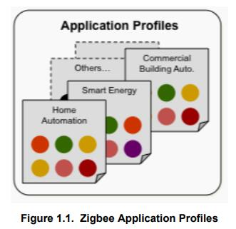

3. 认证 - Zigbee 应用程序经联盟认证，以向最终用户表明该设备是合规的。使用私有配置文件的应用程序将获得认证，证明其正在使用正确操作的 Zigbee 栈，并且在运行期间不会对其他 Zigbee 网络产生负面影响。详情请参阅 [7. Zigbee 合规性](#7-zigbee-合规性)。

由于 Zigbee 致力于开放和可互操作的设备，因此它们存在或开发的地方都采用了标准，从物理层到应用层，如下图所示。在物理层和 MAC（介质访问控制）层，Zigbee 采用 IEEE 802.15.4 标准。网络，安全和应用层都是由 Zigbee 联盟开发的。其还开发了一个由网关和调试工具等支持系统组成的生态系统，以简化 Zigbee 网络的开发和部署。标准的扩展和附件还在继续开发中，Silicon Labs 致力于支持这些标准。

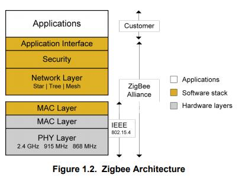

后面三个小节描述了 Zigbee 网络的一般特征，讨论了 IEEE 802.15.4 标准的使用，并总结了 Zigbee 网络的硬件和软件元素。

## **1.1 一般特征**

Zigbee 旨在成为一种经济高效的低功耗解决方案。它面向多个市场，包括家庭自动化，楼宇自动化，传感器网络，智能能源和个人健康护理监测。Zigbee 网络的一般特征如下：
* 低功耗 - 设备通常可以使用合适的工作周期在 AA 型电池上运行数年。通过极其谨慎的设计和特殊的电池技术，一些 Zigbee 设备（如燃气表）可以达到 20 年的电池寿命。
* 低数据速率 - 2.4 GHz 频段下支持 250 kbps 的无线数据速率。网络中的实际持续流量速率低于理论值。因此，Zigbee 更适用于采样和监控应用或基本控制应用。请参见 **AN1138：Zigbee Mesh Network Performance** 和 **AN1142：Mesh Network Performance Comparison**。
* 小型和大型网络 - Zigbee 网络从几个设备到数千个无缝通信的设备不等。网络层设计有多种不同的数据传输机制（路由类型），以根据预期用途优化网络操作。
* 范围 - 典型的设备提供足够的范围来覆盖普通家庭。易用的功率放大器设计大幅度地扩展了范围。在物理层上使用分布式扩频，以更好地抵抗干扰。
* 简单的网络安装、启动和操作 - Zigbee 标准支持多种网络拓扑。用于形成和加入网络的简单协议允许系统在发生路由问题时自行配置和修复。

## **1.2 IEEE 802.15.4**

Zigbee 网络基于 IEEE 802.15.4 MAC 层和物理层。802.15.4 标准在 2.4 GHz 频段下以 250 kbps 运行，在 900/868 MHz 频段下以 40 kbps/20 kbps 运行。许多芯片公司提供 2.4 GHz 频段下的解决方案，其中少数支持 900/868 MHz 频段。Zigbee PRO 使用 802.15.4-2003。

802.15.4 MAC 层用于基本消息处理和拥塞控制。该 MAC 层包括形成和加入网络的机制、用于监听空闲信道的设备的 CSMA 机制，以及用于相邻设备间可靠通信的重试处理和消息确认的链路层。Zigbee 网络层建立在这些底层机制之上，以在网络中提供可靠的端到端通信。802.15.4 标准可从 [www.ieee.org](https://www.ieee.org/) 中下载。

802.15.4 标准在 MAC 层中提供了 Zigbee 在任何当前栈配置文件中都未使用的一些选项。这种未使用的特性的一个例子是保证时隙（GTS），其将被网络用于跨设备同步无线电活动。因此，这些项通常不包含在 Zigbee 软件栈中以节省代码空间。Zigbee 还对 Zigbee 规范附录 D 中记录的 802.15.4 MAC 进行了具体更改。

## **1.3 硬件和软件元素**

Zigbee 解决方案需要实现 Zigbee 无线电和相关的微处理器（在单个芯片中或单独的），并在 Zigbee 栈之上实现应用程序。EmberZNet PRO 是 Silicon Labs 的 Zigbee PRO 栈实现。

典型地，开发人员可以购买 Zigbee 无线电和软件作为捆绑包，尽管已经有一些第三方软件栈。通常，硬件和软件供应商提供包括用于软件的示例应用和硬件的参考设计。基于这些，硬件开发人员可以根据自己的特定需求定制硬件。或者，许多模块提供商可以提供紧凑且低成本的定制模块。

由于典型 Zigbee 应用程序的嵌入特性，软件应用程序开发通常与硬件设计相互关联，以提供最佳解决方案。Silicon Labs 提供基于 Zigbee 规范的标准网络 API 和应用框架，其为客户提供一种基于 Zigbee 应用程序配置文件和 Zigbee 簇库（ZCL）的快速开发应用程序方法，如下所述。另外，许多第三方软件开发公司专门开发 Zigbee 应用程序，并可以协助新产品开发。

### **1.3.1 关于应用框架**

任何应用程序都可以从头开始构建，但这是一个缓慢且冗长的过程。另一种方法是获取工作代码并对其进行修改以满足应用程序的要求。适应工作设计是构建应用程序的一种更简单，更有效的方法，尤其是使用新技术的第一个应用程序。为了解决这个问题，Silicon Labs 不仅提供示例应用程序代码，还提供一个或多个应用框架作为其开发平台的一部分。应用框架包含存储在库和插件中的 Silicon Labs 提供的代码体，Silicon Labs 还提供 Simplicity Studio，其中包括基于 Application Builder（AppBuilder）的集成开发环境（IDE）。AppBuilder 是一个交互式GUI工具，允许您配置应用框架中包含的库和插件，以在应用程序配置文件中实现设备，如 ZigBee Smart Energy 仪表。

应用框架目前有两种样式或版本（version 2 and version 6）。该版本确定已安装的目录结构，可用的元数据以及某些功能是硬编码还是通过插件可用。这两个版本之间的差异在 **UG102：Application Framework User Guide** 中详细地描述。 EmberZNet PRO 栈包括两个版本的应用框架。Zigbee PRO 应用框架，也称为 ZCL Application Framework V2，是一个 version 2 框架，通常称为 AFV2。网络协处理器应用框架也随 EmberZNet PRO 栈一起提供，其使用 version 6 开发。

AFV2 基于 ZCL（ZigBee 簇库），用于开发 ZigBee PRO 应用程序。它提供了一组嵌入式代码，用于实现 ZCL-based cluster 处理、所需的网络任务和典型的 ZigBee 应用程序状态机，并包括对 Zigbee 3.0 应用层的支持，以及许多传统的 Zigbee 配置文件（例如 Home Automation（HA），Smart Energy（SE）和 Zigbee Light Link（ZLL））。此代码是根据 Silicon Labs 推荐的最佳实践和不同 ZigBee 应用程序配置文件的规范开发的，可作为一种 “软件参考设计”，可在片上系统（如 EFR32）上运行或者在主机处理器上连接到基于 EZSP（EmberZNet 串行协议）的网络控制处理器。

Silicon Labs 正致力于将这两个版本协调为一个框架版本。与此同时，无论它们是在 v2 还是 v6 下开发的，应用框架都提供了通用的基本服务，并且当与特定于设备的代码结合使用时，可为您提供设备的大部分的无线行为。然后，您的任务就是开发特定于硬件的功能，并将其与 Silicon Labs 软件连接起来。每个 Silicon Labs 栈版本都提供了一些基于相关应用框架的常见用例示例。

使用应用框架有以下好处：
* 帮助维护一个通用方法，并遵守协议标准和 Silicon Labs 最佳实践。
* 帮助确保协议合规性，因为 Silicon Labs 通过预合规性测试运行应用框架。
* 允许简易地合并更新，因为 Silicon Labs 维护核心组件。
* 提供在应用程序中包含复杂任务的能力，而无需在代码级管理这些任务。
* 提供可配置性，同时维护协议合规性以及简易地更新到未来栈版本的能力。
* 提供一个 回调/命令 接口和一组配置点，这些配置点通常更远离栈，因此与栈级行为相比更符合应用层行为。
* 提供一组插件来说明更高级应用程序逻辑的 “最佳实践” 实现，例如调试功能和 CLI 功能、ZCL 簇实现、应用程序状态机或复杂功能。

所有这些都有助于加快产品上市速度和更强大的解决方案。

### **1.3.2 其他工具和实用程序**

除了 Simplicity Studio 和 AppBuilder，Silicon Labs 还提供了许多在开发过程中可供开发人员使用的实用程序和工具，包括：
* Over-the-air（OTA）bootloaders，允许在部署后升级系统软件
* 网关接口，以将 Zigbee 网络连接到其他系统
* 微处理器的编程工具
* 网络嗅探器和调试工具，允许查看和分析网络操作
* 与领先公司合作的处理器调试工具

------------------------------------------------------------------------------------------------------------------------

# **2. Zigbee 网状网络**

嵌入式网状网络允许无线电中继其他无线电的消息，从而使无线电系统更加可靠。例如，如果节点不能直接向另一节点发送消息，则嵌入式网状网络通过一个或多个中间节点中继消息。

EmberZNet PRO 支持三种类型的网状网络拓扑，如下图所示：
* 星形网络
* 全网状网络
* 混合网状网络

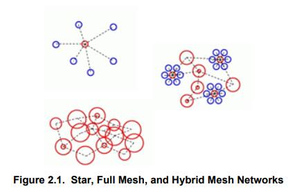

> Note：上图中的蓝色设备是终端设备，可能处于睡眠或移动状态。有关终端设备的更多信息，请参见 [3. 网络节点类型](#3-网络节点类型)。

## **2.1 星形网络**

在星形网络中，一个集线器是所有通信的中心点。集线器可能会成为 网络/处理 带宽的瓶颈。这种拓扑结构不太像网状，传输受到集线器通信半径的限制。外围节点可以通过电池供电。在 EmberZNet PRO 栈中，此拓扑由一组终端设备和一个协调器节点组成，协调器作为父节点，并节点充当网络集线器。

## **2.2 全网状网络**

在全网状网络中，所有节点都是路由器节点，包括形成网络后的协调器节点。由于所有节点都可以为所有其他节点中继信息，因此该拓扑最不容易受到链路故障的影响；一个设备极不可能充当整个网络的单点故障。

## **2.3 混合网状网络**

混合网状网络拓扑结合了星形和网状策略。其存在几个星型网络，但它们的集线器可以作为网状网络进行通信。混合网络允许比星形拓扑更长的通信距离和比网状拓扑更多的分层设计能力（PS：更大的容量）。此拓扑由 EmberZNet PRO 栈形成，其使用路由器设备作为星型子网络的集线器，其可以被终端设备附着连接。

拓扑的选择必须考虑哪些节点是线路供电的或电池供电的、预期的电池寿命、所需的网络流量、延迟要求，解决方案成本以及其他因素。详情请参见 **UG103.3：Software Design Fundamentals**。

------------------------------------------------------------------------------------------------------------------------

# **3. 网络节点类型**

Zigbee 规范在单个网络中最多支持一个协调器，多个路由器和多个终端设备。后面各小节介绍了这些节点类型。

## **3.1 协调器**

Zigbee 协调器（ZC）负责形成一个集中式网络。协调器是具有一些附加功能的路由器，其使用一个为 0x0000 的硬编码网络地址。Zigbee 协调器的功能包括在扫描到可用通道后选择合适的通道，以及选择扩展 PAN ID（有关扩展 PAN ID 的详情，请参见 [5.4 扩展 PAN IDs](#54-扩展-pan-ids)）。在形成网络之后，协调器充当路由器。

协调器还增加了一些职责，例如充当信任中心或网络管理器。信任中心管理网络的安全设置和授权。网络管理器监视和纠正网络问题，例如 PAN ID 冲突或由于干扰导致的信道变化。这些选择取决于应用程序开发人员，并在某些情况下由使用的应用层（如 Zigbee 3.0）完成。

> Note：在启动网络时，出于安全目的，只能将网络协调器指定为集中式信任中心。

## **3.2 路由器**

Zigbee 路由器设备为网络设备提供路由服务。路由器也可以作为终端设备。与终端设备不同，路由器不是为睡眠而设计的（PS：即 低功耗/周期性 工作），只要网络已建立就应该保持开启状态。

## **3.3 终端设备**

终端设备（ZED）是叶节点（PS：即子节点）。它们只能通过其父节点进行通信，与路由器设备不同，它们不能中继其他节点的消息。

根据网络栈，终端设备可以有以下几种类型：
* 嗜睡终端设备（EmberNodeType EMBER_SLEEPY_END_DEVICE），其在空闲时关闭其无线电，从而节省资源。但是，它们必须轮询其父节点以接收传入的消息和确认；父节点在嗜睡终端设备请求数据之前，不会向其发送数据。嗜睡终端设备有时也被称为 rx-off-when-idle 设备。这是标准的 Zigbee 设备类型。
* 非嗜睡终端设备（EmberNodeType EMBER_END_DEVICE），其不会为其他设备路由消息，但它们在操作期间保持供电。这些设备称为 rx-on-when-idle 设备。这是标准的 Zigbee 设备类型。

EmberZNet PRO 栈支持上述两种终端设备。节点类型的选择必须仔细考虑。例如，在一个非常密集的网络中，所有线路供电的节点都为路由器不是总是有利的，因为当子节点试图找到与之通信的父节点时可能会发生干扰的问题。重要的是尝试创建一个平衡的网络，其中所有节点都具有冗余的路径，但没有过多的路由器在附近制造干扰。

------------------------------------------------------------------------------------------------------------------------

# **4. Zigbee 路由概念**

## **4.1 概述**

Zigbee 有几种路由机制，可以根据网络和预期流量模型来使用。在 Zigbee 规范，文档 05-3474 中，第 3.4 节描述了命令帧的帧格式，第 3.6.3 节描述了路由行为。

应用程序设计人员应选择将哪种机制用作系统体系结构和设计的一部分。在实际实践中，一个应用程序可以使用这些路由机制中的若干个，因为一些设备可以执行一对一通信，而其他设备可以与中央监控设备通信。下面讨论的路由类型是：
* 表路由(Table Routing)
* 广播路由(Broadcast Routing)
* 多播路由(Multicast Routing)
* 多对一/源 路由(Many-to-One/Source Routing)

### **4.1.1 表路由**

当一个节点发送路由请求以发现到另一个节点的路径时，形成路由。在两个节点间的路由被发现后，源节点按照其路由表中所指定的将其消息发送到路由中的第一个节点。每个中间节点使用其自己的路由表将消息转发到路由的下一个节点（即 “跳”），直到消息到达其目的地。如果路由失败，则将路由错误发送回消息的发起者，然后发起者可以重新发现该路由。

### **4.1.2 广播路由**

广播路由是一种向网络中的所有设备发送消息的机制。网络级广播选项仅用于发送到路由器，包括终端设备的所有非嗜睡节点，或者也发送到嗜睡终端设备。广播消息会被网络中所有具有路由器能力的设备重复三次，以确保传递到所有设备。虽然广播是一种发送消息的可靠方式，但由于其对网络性能有影响，所以应谨慎使用广播。重复广播会限制网络中可能发生的任何其他流量。广播也不是传递给嗜睡设备的可靠方式，因为父设备负责缓冲嗜睡子设备的消息，该消息可能在终端设备唤醒接收之前被丢弃。

### **4.1.3 多播路由**

多播路由提供一对多路由选项。当一个设备想要向一组设备发送消息时使用多播，例如一个灯开关向一组 10 盏灯发送一个开启命令。在此机制下，所有设备都加入了一个多播组。只有那些属于该组的成员设备才会收到消息，但其他设备将路由这些多播消息。多播是带过滤器的限制性广播。它应仅在应用程序必要时使用，因为过度使用广播机制会降低网络性能。多播消息是永远不会被确认的。

### **4.1.4 多对一/源 路由**

多对一路由是一种简单的机制，允许整个网络具有一条到中央控制或监视设备的路径。在正常的表路由下，中央设备及其附近的设备将需要路由表空间来存储网络中每个设备的下一跳和中央设备本身的入口。鉴于 Zigbee 网络中经常使用存储器受限设备，这些大型表是不必要的。

在多对一路由下，称为 “集中器” 的中央设备发送单个路由发现，该发现在所有路由器中建立单个路由表条目以向中央设备提供下一跳。这产生了一个类似于表路由的结果，但其具有单个多对一路由请求，而不是从每个路由器向集中器的多个单独的一对一路由请求。

然后，网络中的所有设备都具有到集中器的下一跳路径，并且只使用了单个表条目。然而，中央设备通常还需要将消息发送回网络。这将导致路由表大小的显著增加，特别是对于最靠近集中器的那些节点，因为它们是集中器到网络其余部分的多个出站路由中的中继点。相反，到集中器的传入消息首先使用路由记录消息来存储沿路由使用的跳跃序列。然后，集中器以相反的顺序将这些下一跳路由存储为称作 “源路由表” 的本地保留表中的 “源路由”。传出消息在消息的网络报头中包括此源路由。然后使用网络报头中的下一跳而不是路由表来路由消息。这提供了大型可扩展网络，而不会增加所有设备的内存要求。应该注意的是，如果要存储这些源路由，则集中器需要一些额外的内存。

有关消息传递的详细信息，请参阅 [www.zigbee.org](https://www.zigbee.org/) 上提供的 Zigbee 规范。

## **4.2 使用链路质量援助路由**

本节中的信息是为那些希望了解网络层操作细节的人提供的，这可以在故障排除过程中证明是有用的。另外，链路状态消息由栈自动处理，应用程序编写者无需关心它。

由于本地底噪，接收器灵敏度和发射功率的变化，无线网络中的链路通常具有不对称的链路质量。路由层必须使用双向链路质量的知识来建立工作路由并优化这些路由的可靠性和效率。它还可以使用这些知识通过单个发现建立可靠的双向路由。

Zigbee 路由器保持对邻居表中的入站链路质量进行跟踪，典型地以物理层作出的平均 LQI（链路质量指标）测量值作为参考。为了处理链路不对称，Zigbee PRO 栈配置文件指定路由器获取并存储由其邻居测量的传出链路开销。这是通过周期性单跳广播交换链路状态信息来实现的，称为 “链路状态” 消息。下面解释链路状态算法，如 EmberZNet PRO 中所实现的。

### **4.2.1 相关邻居表字段的描述**

Zigbee 路由器在邻居表中存储有关相邻 Zigbee 设备的信息。对于每个路由器邻居，该条目包括以下字段：
* 平均传入 LQI(average incoming LQI)
* 传出开销(outgoing cost)
* 年龄(age)

传入 LQI 字段是来自邻居的所有传入数据的 LQI 的指数加权移动平均值。使用查找表从该值计算邻居的传入开销。

传出开销是邻居在其邻居交换消息中报告的传入开销。传出开销为 0 意味着开销未知。如果条目具有非零传出开销，则称为 “双向”，否则称为 “单向”。

年龄字段测量自收到最后一个邻居交换消息以来的时间量。新条目从 0 岁开始。每个 **EM_NEIGHBOR_AGING_PERIOD** 会增加年龄，目前为 16 秒。接收邻居交换数据包会将年龄重置为 **EM_MIN_NEIGHBOR_AGE**，前提是该年龄已经至少为 **EM_MIN_NEIGHBOR_AGE**（当前定义为 3）。这使得可以识别最近添加到表中的节点并避免驱逐它们，从而减少了密集网络中的系统颠簸。如果年龄大于 **EM_STALE_NEIGHBOR**（当前为 6），则该条目将被视为陈旧的，并且传出开销将重置为 0。

### **4.2.2 链路状态消息**

路由器每 16 秒（加上或减去 2 秒的抖动）发送链路状态消息。如果路由器没有双向链路，则发送速度提高到八倍。数据包作为不带重试的单跳广播发送。在 EmberZNet PRO 栈中，它们作为 Zigbee 网络命令帧发送。

有效载荷包含所有非陈旧邻居的短 ID 列表，以及它们的传入和传出开销。传入开销始终为 1 到 7 之间的值。传出开销为 0 到 7 之间的值，值 0 表示未知的传出开销。有关帧格式的详细信息，请参阅 Zigbee 规范。链路状态消息由 Simplicity Studio 网络分析仪自动解码，以便于参考。

在接收到链路状态消息时，要么该邻居已经存在一个邻居条目，要么如果有空间或邻居选择策略决定用它替换旧条目则会添加一个邻居条目。如果条目没有进入表中，则简单地丢弃数据包。如果条目进入到表中，则传出开销字段将与发送方的邻居交换消息中列出的接收节点的传入开销一起更新。如果消息中未列出接收方，则将传出开销字段设置为 0。年龄字段设置为 **EM_MIN_NEIGHBOR_AGE**。

### **4.2.3 网络层如何使用双向开销**

如上所述，路由算法利用双向开销信息来避免创建断掉的路由，并优化已建立路由的效率和稳健性。对于熟悉 Zigbee 路由发现过程的读者，本小节详细介绍了如何使用传出开销。该机制非常简单，但提供了上述所有优点。

在接收到路由请求命令帧时，将在邻居表中搜索发送设备的对应条目。如果没有找到这样的条目，或者条目的传出开销字段的值为 0，则丢弃该帧并终止路由请求处理。

如果找到具有非零传出开销的条目，则传入和传出开销的最大值用于路径开销计算，而不是仅用于传入开销。该值还用于在重发之前增加路由请求帧的路径开销字段。

### **4.2.4 关键概念：快速响应**

快速响应允许已启动或重置的节点快速获取与其邻居的双向链路，从而最大限度地缩短应用程序必须等待栈准备好参与路由的时间。此特性是 100％ Zigbee 兼容的。

如果收到的链路状态消息不包含双向链路，并且接收方已将发送方添加到其邻居表中，则接收方立即发送其自己的链路状态消息，以便快速启动发送方。该消息仍然通过 2 秒抖动，以避免与其他快速响应者发生冲突。为了避免连锁反应，快速响应者必须自己至少有一个双向链路。

### **4.2.5 关键概念：连接管理**

本质上 Zigbee 设备受 RAM 限制，但 Zigbee 网络通常是密集的。这意味着每个路由器都在大量的其他路由器的无线电范围内。在这种情况下，邻居的数量可以超过设备邻居表中的最大条目数。这时，错误地选择保留哪些邻居会导致路由效率低下或更糟糕（网络断开）。EmberZNet PRO 栈采用 100％ Zigbee 兼容的算法来管理密集网络中邻居的选择，以优化网络连接。

## **4.3 路由发现与修复**

Zigbee 中的路由由网络层自动处理，应用程序开发人员通常不需要关心其行为。然而，在需要发现或修复路由时了解网络的行为是很有用的。

### **4.3.1 路由发现**

当单播消息从一个设备发送到另一个设备并且没有预先存在的路由时将启动路由发现。

我们假设没有现有的路由，因此网络软件将开始路由发现过程。为简单起见，假设所有设备的路由表都是空白的。

例如，假设设备 A 需要向设备 C 发送消息，如下图所示。设备 A 将向整个网络广播一个消息，以请求设备 C 进行回复。该广播消息还用于建立返回 A 的临时路由，因为每个中间设备将记录发送消息给它的设备。路由在中间节点上更新 - 请注意，这些是临时条目，其生命周期比常规条目短，并且不打算重复使用。因为 A 是单跳邻居，所以 B 和 D 不需要存储关于它的路由信息。

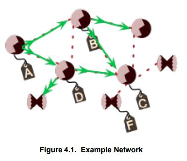

C 可以使用 B 或 D 作为其下一跳。Zigbee 将此选择留给实现；Silicon Labs 使用加权算法来选择最明显可靠的下一跳。

当消息到达设备 C 时，C 使用步骤 1 中建立的临时路由将特殊的单播消息（称为路由响应消息）发回给 A，如下图所示。中间设备使用此消息建立一个（常驻）路由返回到 C。

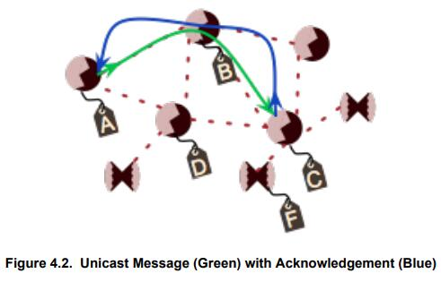

由于 C 是单跳邻居，因此 B 不需要存储有关它的路由信息。D 不参与发现过程的这一部分，因为在上述步骤中 A 没有选择它。当消息到达设备 A 时，路由发现完成，新路由可用于从 A 到 C 发送数据消息。

Zigbee PRO 网络将检测非对称 RF 链路并在路由发现期间避开它们。这提高了发现过程和结果路由的可靠性。

在特定超时期限内（EmberZNet 3.0 及更高版本中为 1 分钟）未使用的路由将被标记为重用，然后新路由可能会覆盖该内存位置。在某些情况下，可能需要一个新路由，并且一个或多个中间设备将不具有可用的路由表条目；在这种情况下，消息将被报告为 “无法传递” 到发送节点。

应用程序指定接收方是否应发送端到端确认（这称为 APS 确认）。如果是，则在确认超时等待的情况下（PS：即未超时情况下）成功传递时将通知发送方。在超时的情况下，可能需要修复路由。

### **4.3.2 路由修复**

当发送带有请求确认的单播消息时，将在消息成功传递时通知发送设备。如果没有收到此确认，则可以采取措施修复路由。路由修复遵循与上述路由发现完全相同的步骤，但是受损节点（下图中的 B）不参与，导致路径选择不同。

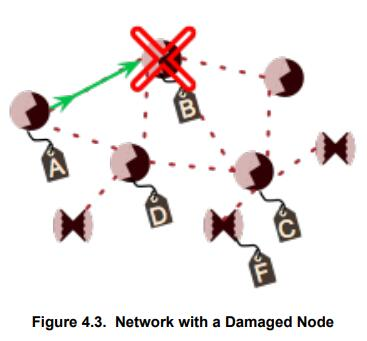

更新 A 的路由表以反映下一跳是 D 并且消息沿新路径成功传递，如下图所示。

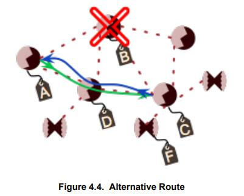

如果没有可用的替代路径，则发送方会被告知消息无法传递。在 EmberZNet PRO 中，这由 EmberStatus 的 **EMBER_DELIVERY_FAILED**（0x66）响应表示。

在执行路径修复之前，EmberZNet PRO 将尝试再次发送消息。在消息选项中设置 **EMBER_APS_OPTION_RETRY** 和 **EMBER_APS_OPTION_ENABLE_ROUTE_DISCOVERY** 时，将自动执行路径修复。

## **4.4 重试和确认**

Zigbee 及其底层网络层提供了一个重试和确认系统，旨在有效地管理 RF 通信的不确定性。为了开始使用 Zigbee，没有必要理解这个概念，但在特定情况下，某些应用程序开发人员可能会对此感兴趣。

本节逐层讨论重试和确认：（PS：retries（重试）；ACKs（确认））
* MAC retries and ACKs (802.15.4)
* NWK retries (Zigbee NWK layer)
* APS retries and ACKs (Zigbee APS layer)

### **4.4.1 MAC Retries and ACKs (802.15.4)**

下图说明了 MAC 层传输重试过程。

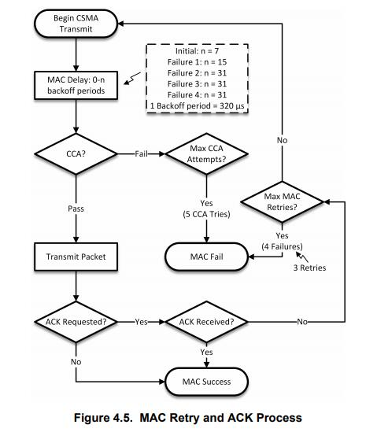

MAC 层尝试传输五次。
* 如果信道非空闲（CCA fail）或未从下一跳目的地接收到 MAC 级 ACK，则将发生单播重试。
* 在 CCA failure 的情况下将发生广播重试，但是广播不使用 MAC ACK 能力。

这些重试发送得非常快 - 完全失败的最大重试时间约为 37 ms。请注意，MAC ACK 会立即从发送方发回，没有额外的 CCA - 有关详细信息，请参阅 802.15.4 文档。

### **4.4.2 NWK Retries**

Zigbee 中的 NWK 重试是特定于供应商的。下图说明了 EmberZNet PRO 栈的 NWK 层传输重试过程。

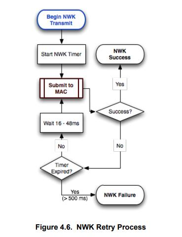

仅当 MAC 层指示传输失败时才发生 NWK 重试。其与 MAC 重试相比操作时间更长，因此在存在 medium term（1-500 ms）interference 的情况下为网络提供额外的稳健性。

Silicon Labs 的干扰研究表明，在某些情况下，NWK 层重试对于克服来自 WiFi 的临时干扰非常重要。
* 单播：单播行为如流程图所述，重试时间最长为 500 ms。
* 广播：广播消息每 500 ms 重发一次，共计 3 次（包括初始广播），或者直到听到所有邻居自己重新广播消息（从而确保完整传输）。

### **4.4.3 APS Retries and ACKs**

下图说明了 APS 层重试过程。

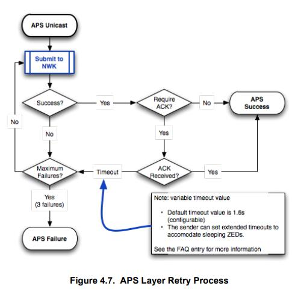

APS 层有一个 ACK 标志，该标志控制是否使用附加逻辑等待确认，并且如果未听到确认则重试。这表示一个来自接收方设备的完整的端到端确认。

在 APS 发送失败的情况下，可以进一步配置 APS 层以修复到目的地的路由。

广播消息没有对等的 APS 端到端确认。

### **4.4.4 总结**

如果可以向目的地发送消息，则自动的 Zigbee 行为提供 “最大努力”，通过尝试在几个不同的时间尺度（从 1 毫秒到几秒）上（与可选的端到端 ACK 和路由修复）进行重试。

如果传递失败，建议应用程序在重试之前等待更长的时间 - 这会给干扰或故障时间以清除。在极端带宽拥塞的情况下，应用程序重试实际上可能会增加问题。

------------------------------------------------------------------------------------------------------------------------

# **5. Zigbee 栈**

Zigbee 提供了几个独立的栈。这一点令人困惑，所以总结如下：
* Zigbee 2004 - 于 2004 年发布，并支持家庭控制照明配置文件。此栈从未与客户广泛部署，不再受支持
* Zigbee 2006 - 于 2006 年发布，支持单个称为 Zigbee 栈的栈（后面解释）
* Zigbee 2007 - 于 2007 年，第四季度发布。它有两个特性集，Zigbee 和 Zigbee PRO

Zigbee 和 Zigbee PRO 栈是 MAC、网络层、安全服务和应用框架的完整实现。实现 Zigbee 和 Zigbee PRO 的设备可以作为其他类型网络中的终端设备进行互操作。例如，如果一个网络是围绕着一个 Zigbee PRO 协调器形成的，那么它只能有 Zigbee PRO 路由器，但其可以有 Zigbee 和 Zigbee PRO 终端设备。

> Note：Zigbee 2004 栈无法与 Zigbee 2007 进行互操作。

Zigbee 栈是围绕一个中央协调器形成的，并使用树状寻址来建立网络。

Zigbee PRO 栈是围绕一个中央协调器形成，但使用随机寻址方案来避免树状寻址的局限性。其始终使用表路由，并提供其他特性，例如：
* 网络级多播(Network level multicasts)
* 多对一和源路由(Many-to-one and source routing)
* 频率捷变(Frequency agility)
* 非对称链路处理(Asymmetric link handling)
* PAN ID 冲突(PAN ID Conflict)
* 分片(Fragmentation)
* 标准或更高的安全性(Standard or high security)

Silicon Labs 不建议在 Zigbee 栈上部署系统，因为 Zigbee PRO 栈具有许多网络的长期运行稳定性和可靠性所必需的特性。Zigbee 栈通常用于小型静态网络。

> Note：Zigbee 2007 规范包括对 Zigbee 栈的更新，以允许在此栈上使用频率捷变和分片。该栈仍然可以与 Zigbee 2006 栈互操作，因此这些特性仅限于那些具有能处理这些特性的某些设备使用，而某些设备则不能使用。

## **5.1 Zigbee 设备对象(ZDO)**

ZDO（占用每个节点的端点 0）是由 Zigbee 网络规范定义的用于网络管理和信息收集的栈级实体。本节介绍如何在 EmberZNet PRO 栈 和/或 EZSP 中使用 ZDO 功能。并且还介绍了一个例子。

ZDO 是栈中的一个实体，它提供网络管理功能，节点可以使用它来了解彼此、关于网络的一般情况或管理某些栈级功能。ZDO 的许多特性必须作为 Zigbee 认证平台（ZCP）的一部分实现，并因此可在所有 Zigbee/Zigbee PRO 设备上使用，这使得它们可用作 Zigbee 网络中收集和管理系统属性的可互操作方式。ZDO 通过一种称为 Zigbee 设备配置文件的 OTA 消息传递格式实现。

以下基本准则适用于使用 ZDO 进行网络管理：
* Broadcasts requests must go to broadcast mask 0xFFFD.
* 请求应总是发送到目标端点 0，应用程序配置文件 ID 为 0x0000，因为这指示 ZDO（栈中固有的）应处理该消息。源端点通常对应于您的应用程序（请求信息感兴趣的）部分。
* 对 ZDO 请求的响应来自源端点 0 到用于请求的源对应的目标端点。
* 如果栈中未实现特定的 ZDO 请求处理程序，则将在响应中返回状态 **EMBER_ZDP_NOT_SUPPORTED**（0x84）。
* 簇 ID 用于指示正在发送的请求或响应类型。
* 大多数请求可以以单播，广播或多播发送，就像任何其他 APS 帧一样（带可选的 APS 确认），并且响应像任何其他传入的 APS 消息一样到达 **IncomingMessageHandler**。然而，某些类型的请求，如果作为广播发送，将不会产生响应（为了节省网络带宽）。还有某些无法发送广播的请求。有关这些特定命令的更多信息，请参阅 Zigbee 核心规范（文档 14-0392）。
* **stack/include/zigbee-device-stack.h** 详细说明了命令和响应的帧格式，包括 EmberZNet PRO 栈支持的请求类型。关于帧格式的更多细节在 Zigbee 网络规范（Zigbee 文档 14-0392）的 Zigbee 设备配置文件（ZDP）部分中描述。
* 可以在 **app/util/zigbee-framework/zigbee-device-library.h** 中找到用于生成 ZDO 请求和解析某些类型响应的实用程序函数（作为源代码提供）。（对于 EZSP 主机应用程序，还有该文件的替代版本）
* 所有 ZDO 请求和响应都以事务序列号作为有效载荷的第一个字节开始。这允许将请求与特定响应匹配。

以 Permit Joining ZDO 事务（这有助于远程控制网络中一个或多个设备的 PermitAssociation 标志）为例。

对于此特定事务，**zigbee-device-stack.h** 解释了以下内容：
```c
1. // Request: [duration:1] [permit:1]
2. // Response: [status:1]
3. #define PERMIT_JOINING_REQUEST 0x0036
4. #define PERMIT_JOINING_RESPONSE 0x8036
```

因此，Permit Joining 请求帧将使用簇 ID 0x0036，响应将以簇 ID 0x8036 到达。对于请求参数，“duration” 字节通常对应于您在 EmberZNet PRO/EZSP 中为 PermitJoining 调用提供的参数（允许加入的秒数，0x00 为总是关闭加入，0xFF 为总是打开加入）。“permit authentication” 字节仅在请求的接收者是信任中心（TC）和控制 TC 是否应该在将来的关联请求期间对 “certain devices” 执行认证时才适用。

然而，当前的 Zigbee 网络规范要求 permit authentication 字节为 0x01，因此 Permit Joining 请求中的此参数不再重要。

允许加入请求通常作为广播发送到所有路由器，允许设备在处理此广播请求后加入到网络中的任何路由器。

### **5.1.1 高级 ZDO 用法**

此外，从 EmberZNet 3.3.2 开始，Silicon Labs 增加了应用程序（主机 MCU）的能力，以便获知栈正在处理的 ZDO 请求，和/或 获知栈无法处理的那些请求（以便它可以自己处理它们），并且如果需要的话还可以让主机有机会处理端点请求（而不是自动处理这些请求）。请参阅 EmberZNet 3.3.2 及更高版本中的 **hal/ember-configuration.c** 文件（在 SoC 平台中）或 **app/util/ezsp/ezsp-enum.h**（针对 NCP 平台的）中的注释，以获取这些可用选项的描述，这些被描述为 **EzspConfigId** 的值 0x26-0x28（在 EZSP 中）或以下配置定义（在 SoC API 中）：
```c
EMBER_APPLICATION_RECEIVES_SUPPORTED_ZDO_REQUESTS
EMBER_APPLICATION_HANDLES_UNSUPPORTED_ZDO_REQUESTS
EMBER_APPLICATION_HANDLES_ENDPOINT_ZDO_REQUESTS
EMBER_APPLICATION_HANDLES_BINDING_ZDO_REQUESTS
```

## **5.2 Zigbee 配置文件**

在 Zigbee 3.0 之前，应用程序配置文件或简单的配置文件位于基本的 Zigbee 栈之上。这些是为了指定设备互操作性所需的 OTA 消息而开发的。给定的应用程序配置文件可以在 Zigbee 或 Zigbee PRO 栈上进行认证。现在，Zigbee 3.0 引入了一个包罗万象的应用层规范，用于为所有 Zigbee 应用程序定义 OTA 行为。

以下是 Zigbee 3.0 之前存在的应用程序配置文件组：
* 家庭自动化(Home Automation, HA) - 用于典型住宅和小型商业设施的设备。
* 智慧能源(Smart Energy, SE) - 用于公用仪表读数和与家用设备的交互。
* 楼宇自动化(Commercial Building Automation, CBA) - 用于大型商业建筑和网络的设备。
* 电信应用(Telecom Application, TA) - 用于电信领域内的无线应用。
* 医疗保健(Health Care, HC) - 用于监测家庭或医院环境中的个人健康。
* 零售(Retail) - 用于零售环境中监控和信息传递。
* 智能照明(Zigbee Light Link, ZLL) - 用于 LED 照明系统的无线控制。

Zigbee 簇库（ZCL）构成了 Zigbee 通用应用层的一般基础。该库定义了共享的通用元素，例如数据类型，并允许重用简单设备，例如不同配置文件之间的 开/关 切换协议。

应用程序配置文件定义了 Zigbee 网络中设备的角色和功能。联盟管理两种类型的应用程序配置文件：
* 公共应用程序配置文件，由 Zigbee 联盟成员开发，以便来自不同制造商的设备可以互操作。
* 制造商特定的应用程序配置文件，由产品开发人员开发，为不需要互操作性的应用程序创建专用网络。

Zigbee 联盟现在承认一个应用层，由 Zigbee 基本设备行为规范描述，该规范定义了设备在任何 Zigbee 网络中的角色和功能。这些应用程序行为可与任何其他应用程序互操作。

如果您基于自己的私有应用层规范开发产品，Zigbee 联盟要求您使用唯一的私有配置文件标识符，以确保产品可以与其他产品共存。Zigbee 联盟会根据要求向会员公司免费发放这些唯一的私有配置文件 ID。

应用程序还可以使用通用的 Zigbee 3.0 应用层开发，该应用层具有针对制造商的特定特性的私有扩展。

## **5.3 Zigbee 寻址方案**

Zigbee PRO 栈使用随机地址分配机制。在这种机制下，协调器仍然用于启动网络。加入到网络的每个设备（路由器和终端设备）将从其加入的设备中获得随机分配的地址。该设备使用网络级消息对此地址进行冲突检测，以确保地址是唯一的。即使父地址发生更改，设备也会保留此地址。

在 Zigbee PRO 下，规定了用于设置和配置网络的试运行工具。该试运行工具可用于手动分配地址。

## **5.4 扩展 PAN IDs**

使用栈（早于 Zigbee 2007）软件的开发人员应该注意到对 PAN ID 的一个新的重要更改。Zigbee 添加了一个 8 字节的扩展 PAN ID（EPID 或 XPID），以促进供应和 PAN ID 冲突检测。扩展 PAN ID 现在包含在信标有效载荷中，跟着现有的 3 个字节。

扩展 PAN ID 是 Zigbee 2007 中的网络参数（EmberZNet 3.x 及更高版本），用于 Zigbee 和 Zigbee PRO 特性集。该扩展 PAN ID\[EPID\] 可以被认为是基本的 16 位 PAN ID\[PID\] 的扩展。EPID 是在个域网\[PAN\]形成时由 Zigbee 协调器\[ZC\] 为整个网络设置的一个 64 位值，并且在 PAN 运行时不得更改（与 PID 不同）。跟 PID 一样，同一 PAN 内的所有节点共享一个 EPID。

除了扫描和加入过程之外，EPID 很少出现在传输的 Zigbee 数据包中，因为它在报头中具有较大的开销（8 字节）。然而，EPID 在 Network Update 事务（网络管理器节点通知 PAN 中的其他设备有 PID 冲突或信道改变）期间使用，以便移到新信道 和/或 PID 的节点可以依赖于 EPID 作为查找已移动网络的准则。

请注意，一旦节点关联到网络中，扩展 PAN ID（即使为零）将保存到非易失性存储器（as part of the tokens），因此在离开网络之前，设备在生命周期内不会对它进行更改。

### **5.4.1 用于 扫描/形成/加入 过程**

通过主动扫描，EPID 将在看到的信标结果中出现（连同其他信息，如 PID），并且当发起加入时，如果加入请求中的 EPID 为非零，则 EPID 将优先作为加入者与被加入网络的主要匹配准则（16 位 PAN ID 实际上被忽略）。然而，某些网络（特别是较旧的网络）可能不希望（或不能够）处理 EPID，因此 EPID 在信标的网络参数中将为零。如果在 JoinNetwork 操作期间请求的 EPID 全为零，则出于关联的目的，将仅使用 16 位 PAN ID 来匹配网络。

虽然 Silicon Labs 为扫描网络和解析结果提供了一些示例实用程序以确定要加入哪一个，但此过程通常会根据应用程序设计和选择网络所需的严格程度而有所不同。（例如，加入设备可能只是想要任何可用的 Zigbee PRO 网络；它可能寻找专门为使用中的应用而设计的封闭网络，但可能不会关心它选择了哪个封闭网络；或者它可能寻找具有特定属性的一个特定的封闭网络，就像我希望家里的笔记本电脑不是加入其他任何的家庭 WiFi 网络，而是加入我家中的 WiFi 网络）。

以下准则适用于 EmberZNet 在确定给定的特定 EPID 的 形成/加入 操作的预期行为时：
* 如果在 FormNetwork 期间为 EPID 指定了全零值，则栈将为此字段生成随机 64 位值。
* 如果在 JoinNetwork 期间为 EPID 指定了全零值，则栈将使用 JoinNetwork 参数中指定的 16 位 PID 作为加入过程中选择网络的主要准则。
* 如果在 JoinNetwork 期间为 EPID 指定了非零值，则栈将使用 JoinNetwork 参数中指定的 64 位 EPID（即使 16 位 PID 不同）作为加入过程中选择网络的主要准则。

### **5.4.2 选择 EPID**

虽然 PID 是一个随机选择的 16 位值，对于每个网络都是唯一的，但 EPID 通常更像是 WiFi 网络的 SSID 字段，以便为用户提供友好的指定（通常不是随机的并由制造商或安装人员设定）。然而，Silicon Labs 不鼓励对所有部署使用固定的 EPID，因为（与 PID 冲突不同）EPID 冲突如果在运行时发生则无法解决（因为不存在区分 PAN 的其他唯一信息）。希望使用非随机 EPID 的客户至少应扫描网络（通过协调器或通过一些外部试运行工具），并检查新 PAN 的首选 EPID 是否已被其他 PAN 使用。一种方法是在形成 PAN 时使用一小组优选的 EPID，以便如果第一选择发生冲突时协调器可以有替代方案。

创建需要客户安装（而不是经过培训的安装人员）的消费级产品的 OEM 应特别注意确保 EPID 的多样性，因为相邻居住的两个客户可能会为他们的家庭购买相同的产品，并且更愿意彼此隔离他们的网络。如果这两个相邻的家庭都使用具有相同 EPID 的 PAN，则两个用户可能会出现网络困境，因为这两个家庭将被视为一个网络，并且可能发生许多网络地址冲突。

### **5.4.3 EPID 对比 PID**

以下是 EPID 和标准 PID 之间差异的快速概述：
* EPID 是 64 位的；PID 是 16 位的。
* EPID 通常作为匹配所请求网络的栈准则；当 EPID 全为 0x00 字节时，仅使用 PID 作为匹配准则。
* EPID 仅存在于几种数据包中（信标，Network Update 消息）；PID 几乎存在于所有 802.15.4 帧中（MAC ACK 除外）。
* EPID 作为唯一标识网络和解决 PID 冲突的准则；PID 用于无线接收器上的 MAC 目标过滤。
* EPID 可以帮助在扫描结果中提供网络身份的一些指示；PID 应始终是完全随机的，因此在确定哪个 PAN 是 “正确的” 时不那么有用。
* EPID 可以是 0x0000000000000001 到 0xFFFFFFFFFFFFFFFE 范围内的任何值（全 0 和全 F 都是保留值）；PID 可以是 0x0000 - 0xFFFE 范围内的任何值（全 F 为保留值）。

------------------------------------------------------------------------------------------------------------------------

# **6. Zigbee 簇库**

## **6.1 概述**

在 Zigbee 簇库（ZCL）中，簇（cluster）是一组用于通过 Zigbee 网络发送和接收相关命令和数据的消息。例如，温度簇将包含发送和接收温度信息所需的所有必要 OTA 消息。

为了便于学习和管理，这些簇进一步分组到功能域里，例如对 HVAC，安全，照明等有用的功能域。如果预定义的簇不满足其特定的应用程序需求，开发人员也可以定义自己的簇。

然后，Zigbee 公共应用层引用在某些应用程序中使用的簇，并指定不同设备支持哪些簇 - 某些簇是强制性的，其他簇是可选的。通过这种方式，ZCL 简化了特定应用程序的文档，并允许开发人员快速了解设备支持的行为。

**Zigbee Cluster Library Specification** 文档（15-02017-002）中描述了更详细的 ZCL 概述、簇内消息的格式以及可在任何簇中使用的一组消息。功能域簇在单独的文档中描述，例如功能域：一般，安全性和安全性文档。

Silicon Labs 提供了源代码，可以轻松地组装和拆解 ZCL 消息，无论它们是由 ZCL 预定义还是由开发人员创建的自定义消息。此外，Silicon Labs 提供了一个名为 AppBuilder 的强大工具，允许开发人员创建和配置他们的大多数基于 ZCL 的应用程序。有关更多信息，请参阅文档 **UG102： Application Framework Developer Guide**。

## **6.2 簇内**

### **6.2.1 客户端和服务端**

每个簇分为两个端，即客户端（client）和服务端（server）。簇的客户端发送的消息可能被服务端接收。客户端还可以接收服务端发送的消息。从这个意义上讲，簇的客户端和服务端始终是互补的。与许多其他系统（例如，HTTP）相比，两者都具有相同的发送和接收消息的潜力：“客户端” 指定并不意味着从属或仅响应状态。

由于所有命令都有发送方和接收方，因此每个簇分为两部分 - 服务端部分和客户端部分，如下图所示。支持簇服务端的设备将与支持同一簇的客户端的设备通信。

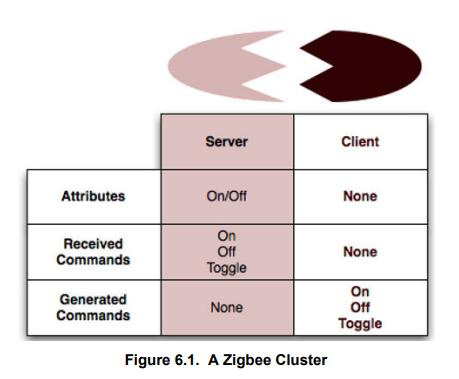

这种平等使讨论复杂化；为清楚起见，当必须使用客户端或服务端之一时，本文档总使用 “簇端”，当谈到客户端和服务端两个时，使用 “两簇端”，以及需要特定的端（通常是例子）时，使用 “簇服务端” 或 “簇客户端”。

### **6.2.2 属性**

属性（attribute）是与簇端相关联的数据；簇的服务端和客户端可以各自拥有多个属性。

每个属性声明一个 16 位标识符，一个数据类型，一个只读或 读/写 指示符，一个默认值，以及一个任何实现的支持是强制还是可选的指示符。下表列出了示例数据类型。

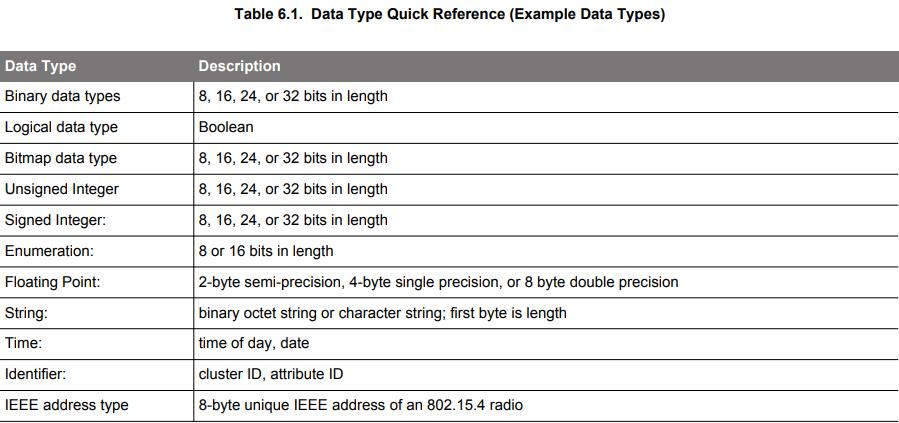

属性标识符仅在特定簇端内是唯一的：这意味着簇服务端中的属性 0x0002 不需要与簇客户端中的属性 0x0002 相同，即使在同一簇中也是如此。

ZCL 规范中详细描述了数据类型。下表是该文档的摘录。

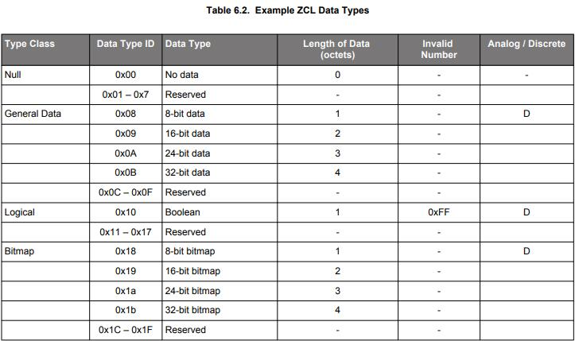

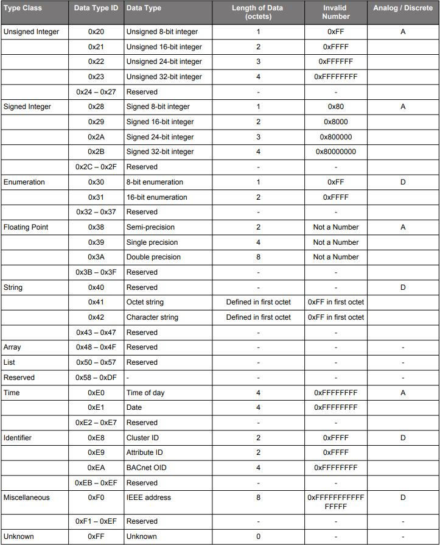

可以通过使用本文档后面描述的属性命令来无线访问属性。

在 ZCL 的第 6 版中引入了全局属性（Global attributes）。这些属性是为设备上的每个簇实例定义的，并且充当普通的 ZCL 属性。Cluster Revision（属性 ID 0xFFFD）是全局属性的一个示例。此属性是对每个单独的簇规范进行版本化，以提高向后兼容性和允许测试特定版本化簇行为的方法。一个设备可以读取另一个设备上的 Cluster Revision 属性，以确定如何通过无线方式向他们传达某些簇行为。对于每个簇的规范的每次主要更改，都会增加此 Cluster Revision 属性。

### **6.2.3 命令**

命令（command）由一个 8 位命令标识符和一个有效载荷格式组成。与属性类似，8 位标识符仅在特定簇端内是唯一的。有效载荷格式对于命令类型是任意的，仅遵循 ZCL 规范中描述的一般数据包格式指南。

命令分为两种类型：全局和簇特定。全局命令在 ZCL 规范中定义，并不特定于任何簇。这些全局命令最初称为 Profile-Wide，但已更改名称以符合 Zigbee 3.0 通用应用层。簇特定命令在 ZCL 功能域文档中的簇定义中定义，并且在定义它们的簇中是唯一的。

#### **全局命令**

全局命令不是簇特定的唯一命令；它们在 ZCL 一般命令帧中定义（参见 ZCL Specification 075123r02, Chapter 7）。下表列出了示例 profile-wide 命令：

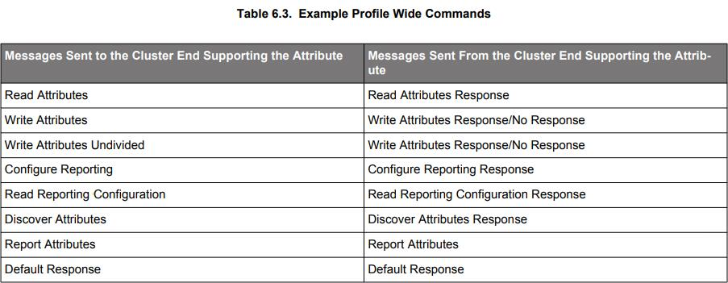

* Read Attributes：请求接收者返回一个或多个属性；回复 Read Attributes Response。
* Write Attributes：为接收者的一个或多个属性提供新值；回复将包含一个 Write Attributes Response 部分，以指示哪些属性已成功更新，和/或 包含一个未成功更新属性的 Write Attributes No Response 部分。
* Write Attributes Undivided：使用 Write Attributes Response 更新所有属性和回复；如果无法更新任何单个属性，则不会更新任何属性，并且此命令将回复 Write Attributes No Response。
* Configure Reporting：配置报告间隔，触发事件和指示属性的目标。回复 Configure Reporting Response。
* Read Reporting Configuration：生成一个 Read Reporting Configuration Response，其中包含作为回复发送的当前报告配置。
* Discover Attributes：请求发送所有支持的属性；使用一个 Discover Attributes Response 回复。
* Report Attributes：通过 Configure Reporting 命令配置的属性值的报告。
* Default Response：当没有更多特定响应可用时发送的响应（并且传入消息未禁用默认响应）。

由于属性始终束缚于簇，因此影响属性的命令要指定要访问或修改的哪些簇和哪些属性。此外，每个簇定义哪些属性支持哪些命令 - 例如，属性可以被声明为 READ ONLY，在这种情况下，它将不支持 Write Attributes 命令。因此，虽然命令格式不是簇特定的，但它描述的属性及其在接收系统上的结果都是簇特定的。

有兴趣了解有关这些消息的格式或特定行为的更多详细信息的读者应查看ZCL规范（075123r02）。

#### **簇特定命令**

有效载荷格式，支持要求（强制，可选）和接收簇特定命令的行为都在簇定义中定义。通常，这些命令会影响接收设备的状态，并可能作为副作用更改簇的属性。

例如，ZCL 定义了 On/Off 簇服务端接收的三个命令（OFF，ON 和 TOGGLE）。它进一步声明这些命令中的每一个都是强制的，以及每个命令的有效载荷格式（在本例中，它们都没有有效载荷）。ZCL 定义 On/Off 簇客户端负责生成服务端接收的命令。

## **6.3 示例：Temperature Measurement Sensor Cluster**

例如，考虑 Temperature Measurement Sensor cluster 的一部分，该部分在 **Zigbee Cluster Library Specification**（15-02017-002）的第 4 章中有详细描述。

下表列出了 ZCL 规范中的一些属性。

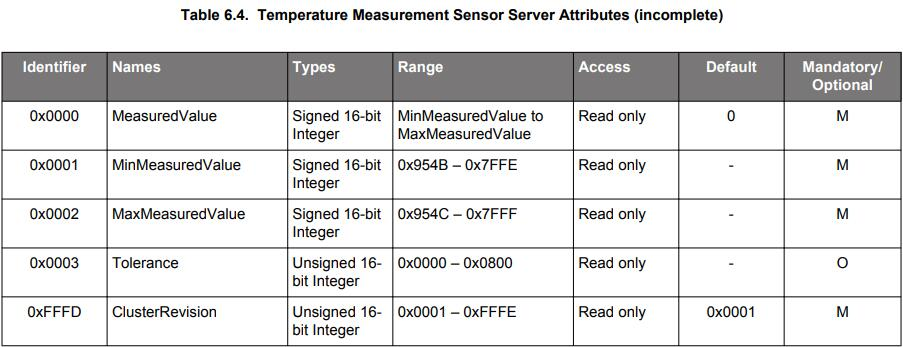

1. 属性概述：该簇服务端至少支持这五个属性，其中四个必须由任何实现（MeasuredValue，MinMeasuredValue，MaxMeasuredValue 和 ClusterRevision）支持，其中一个可以选择支持（Tolerance）。所有这些属性都是只读的，表明对它们的任何写入尝试都将失败。请注意，ClusterRevision 全局属性是一个常规属性。
2. 簇服务端和簇客户端的含义：显然，簇服务端应该由包含温度传感器的设备实现。同时，簇客户端应由希望主动（通过读取属性命令）或被动地（通过首先配置报告属性命令，然后从报告属性）接收温度传感器信息的任何设备实现。
3. 更多信息：簇描述还提供有关数据实际格式的有用信息（例如，MaxMeasuredValue 的带符号 16 位整数的范围）和强制支持的操作 - 并非所有属性都支持所有基本命令。例如，MaxMeasuredValue 是只读命令，无法写入。
    > Note：虽然支持传入写入属性命令，但在这种情况下，MaxMeasuredValue 始终生成 Write Attributes No Response 回复。
4. 命令：此簇（服务端或客户端）不支持自定义命令。有关包含自定义命令的簇的示例，请参阅 ZCL（15-02017-002）中的 Thermostat Cluster。

## **6.4 功能域**

在撰写本文时，Zigbee Cluster Library 定义了以下功能域：
* 一般(General)
* 封闭(Closures)
* 空调(HVAC)
* 照明(Lighting)
* 测量&传感(Measurement & Sensing)
* 安全&保障(Security & Safety)
* 协议接口(Protocol Interfaces)
* 智慧能源(Smart Energy)
* 无线升级(Over-the-Air Upgrading)
* 电信(Telecommunications)
* 试运行(Commissioning)
* 零售(Retail)
* 电器(Appliances)

每个域定义了许多簇，然后 Zigbee 应用层使用这些簇来描述设备的 OTA 行为（请参见下图）。


## **6.5 制造商扩展**

ZCL 允许以两种方式扩展现有库：用户可以向现有簇添加制造商特定的命令或属性，或者他们可以定义制造商特定的全新簇。

通过在 ZCL 头中设置特殊位和包含制造商代码（从 Zigbee 联盟领到的）来识别制造商特定的命令。这可以保证制造商特定的扩展不会干扰其他制造商特定的扩展或现有的 ZCL 簇，命令或属性。

制造商特定的簇必须使用范围为 0xFC00-0xFFFE 的簇 ID。

------------------------------------------------------------------------------------------------------------------------

# **7. Zigbee 合规性**

Zigbee 合规性基于合规性测试的构建块，用于确保每个层都经过测试。

符合所有合规性要求的产品可以标记为 “Zigbee Compliant”，并可以显示 Zigbee 徽标。

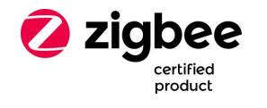

Zigbee 无线电和 MAC 必须通过 IEEE 802.15.4 认证测试的适用部分。不需要 Zigbee 操作的 MAC 部分不需要进行该测试。

Zigbee 栈需要在经过认证的 IEEE 802.15.4 平台上构建。Zigbee 栈提供商需要根据一个称为 Zigbee 兼容平台测试的标准 Zigbee 测试计划对栈进行测试。此测试验证栈的基本网络，安全性和 Zigbee 设备对象（ZDO）操作。

Zigbee 产品需要在符合 Zigbee 标准的平台上构建。开发人员可以选择构建公共或制造商特定的应用程序。针对制造商特定的那些应用程序需针对特定测试集进行测试以验证基本操作。基于通用 Zigbee 应用层的产品使用针对应用层命令的标准 Zigbee 测试进行更广泛的测试。Zigbee 3.0 的测试审查力度大大增加；现在有很多负面的测试用例，产品必须通过才能通过认证。

Zigbee Test Harness 是 Zigbee 3.0 中的新功能。其提供给 Zigbee 成员用于测试他们的产品，并且还用于 Zigbee 3.0 产品的最终合规性测试。Zigbee Test Harness 涉及在兼容的 IEEE 802.15.4 平台上运行的 test harness Zigbee software stack 和为测试人员提供友好用户界面的桌面应用程序。

每个出货产品必须经过认证，并且在认证后对产品进行本质性更改可能需要重新认证。Silicon Labs 通过合规性测试发送所有芯片和栈。

所有 Zigbee 测试计划均使用至少三个成员的产品进行开发和测试，以确保不同实现之间的互操作性。

公司必须成为 Zigbee 联盟的成员才能运送包含 Zigbee 栈的产品。Zigbee 网站（www.zigbee.org）上详细介绍了在产品上使用 Zigbee 徽标的具体规则。

------------------------------------------------------------------------------------------------------------------------

# **8. Zigbee 3.0**

Zigbee 3.0 标志着 Zigbee 联盟新篇章的开始。Zigbee 3.0 将所有不同的应用程序配置文件组合到一个通用的应用层中。此外，它还为产品认证引入了更大的测试覆盖率，确保了 Zigbee 设备在现场的更好互操作性。Zigbee 3.0 文档套件包含 Zigbee 应用程序规范的修订版和全新材料。

基本设备行为规范（BDB）可能是 Zigbee 3.0 文档套件中最重要的新文档。它为任何 Zigbee 产品指定强制和可选的应用层行为。这些行为包括但不限于：
* 网络试运行(Network commissioning)
* 网络安全(Network security)
* ZDO 命令处理(ZDO command handling)
* 报告(Reporting)
* MAC 数据轮询(MAC data polling)
* 持久性数据(Persistent data)

有关这些项的更多具体信息，请参见文档 13-0402。由于现在所有 Zigbee 应用程序都有一个规范，因此在不同应用程序域中的两个不同的 Zigbee 3.0 兼容产品可以在同一网络上进行互操作（例如，灯开关和车库门开启器可以在同一网络上执行单独的功能）。

BDB 的核心是 Zigbee 3.0 设备可以使用的试运行方法。这些方法遵循一个执行顺序，但它们对于设备都是可选的。例如，Zigbee 终端设备切换应用程序以执行 touchlink 试运行，经典加入，然后查找和绑定可能才有意义。另一方面，Zigbee 协调器网关应用程序可能只希望形成网络。最后，也许 Zigbee 路由器灯应用程序可以执行经典加入，然后如果没有找到任何要加入的网络，则回退到经典网络形成。试运行方法和顺序如下。
* Touchlink 试运行(Touchlink commissioning)
* 经典网络加入(Classical network joining)
* 经典网络形成(Classical network formation)
* 查找和绑定(Finding and binding)

Touchlink 试运行是 Zigbee 3.0 网络试运行过程的第一步。设备可以选择执行 touchlink 过程以使发起者尝试找到 touchlink 目标。这种交互的典型示例可以是开关和灯。开关可以执行 touchlink 试运行以在与灯相同的网络上建立自己。有关 touchlink 试运行的更深入描述，请参见 13-0402。

BDB 定义过程的下一步是经典加入。这意味着找到开放的网络并使用原始的 Zigbee 加入过程加入一个网络。查找一个网络涉及在产品定义的信道集上执行 IEEE 802.15.4 主动扫描。一旦设备找到了它希望加入的网络，它就可以使用安装代码派生的链路密钥，集中式安全网络的默认链路密钥和分布式安全网络的默认链路密钥加入到该网络。有关 Zigbee 3.0 应用层中涉及的安全机制的更多信息，请参阅 **UG103.5：Security Fundamentals**。

然后，Zigbee 3.0 应用程序可以选择形成经典的 Zigbee 网络。产品可以形成集中式安全网络并作为信任中心，或者形成分布式安全网络并作为路由器。这与许多只有 Zigbee 协调器可以形成网络的传统应用程序配置文件不同。灯可能希望作为路由器以形成网络，以便它可以充当 touchlink 目标，而对于网关作为信任中心形成的集中式网络则更有意义。信任中心可以选择仅允许网络上的某些设备使用安装代码派生的链路密钥进行加入。再次，请参阅 **UG103.5：Security Fundamentals**，以全面讨论 Zigbee 3.0 安全性。

一旦设备在网络上，他们就可以执行查找和绑定，其中设备创建绑定以建立应用层链路。例如，On/Off 开关可以执行查找和绑定以创建对 On/Off 灯的绑定。同样，与所有试运行步骤一样，此步骤是可选的。

如前所述，Zigbee 3.0 还对产品进行了更严格的测试。这意味着产品在进入市场之前将经历更多负面的测试用例和特定的簇功能测试。Zigbee 3.0 文档套件中包含新的 Cluster Test Specifications。这些文档包含实现某些簇的 Zigbee 产品的测试用例。对于使用某个簇进行 Zigbee 3.0 认证的产品，它必须通过该文档中包含的针对该特定簇的测试用例。每个簇测试规范都有一个单独的 Zigbee 文档。有关示例，请参阅文档 15-0310，On/Off Cluster 测试规范。

Zigbee 3.0 还要求设备应支持 Green Power 的代理功能，Green Power 是专为能量收集终端设备设计的网络和应用级规范。从本质上讲，这意味着每个 Zigbee 3.0 设备都能够处理 Green Power 消息并将其转发到具有更多应用层 Green Power 功能的其他设备。Green Power Basic 规范和测试规范包含在 Zigbee 3.0 文档套件中。

值得一提的是，Zigbee Cluster Library 的第 6 版（文档 15-02017）也包含在 Zigbee 3.0 文档套件中。有关此规范的更多信息，请参见 [6. Zigbee 簇库](#6-zigbee-簇库)。

------------------------------------------------------------------------------------------------------------------------

# **9. 应用 Zigbee**

必须在任何 Zigbee 实现中做出一组设计决策。有关更多信息，请参阅 **UG103.3：Software Design Fundamentals**。

------------------------------------------------------------------------------------------------------------------------
